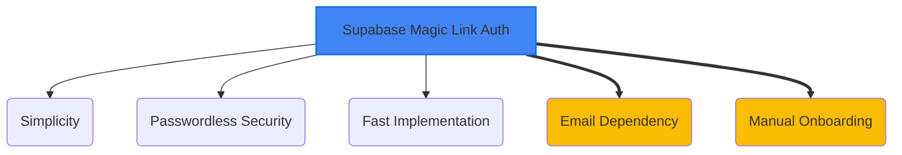

# Admin Authentication System

*Version: 1.0*
*Date: 2025-03-30*
*Author: Roo (AI Architect)*

## Status
Proposed - 2025-03-30

### Context
The Philosothon platform requires a secure method to authenticate administrators for accessing protected areas, specifically for managing event content (themes, workshops, FAQ) and viewing imported registration data. For the MVP, only a small, trusted group of event organizers requires access. Participant authentication is not required initially.

### Decision Drivers
- **Simplicity & Speed**: Need the simplest secure solution implementable within the 2-day MVP timeline.
- **No Participant Accounts**: MVP scope explicitly excludes participant logins.
- **Security**: Must restrict access reliably to authorized personnel only.
- **Cost**: Solution should fit within the Supabase free tier.
- **Compliance**: Must align with University policies regarding access control and data handling.

### Decision
We will use **Supabase Auth's built-in Email Magic Link** feature for administrator authentication. Access will be restricted to specific email addresses belonging to authorized event organizers, enforced via Supabase Auth settings and potentially Row-Level Security (RLS) checks.

Key implementation aspects include:
- Configuring Supabase Auth to allow only magic link logins.
- Restricting sign-ups/logins to a predefined list or domain (e.g., `@utoronto.ca` or specific organizer emails).
- Implementing session management using Supabase's client library (`@supabase/supabase-js`).
- Protecting admin routes and API endpoints in Next.js based on Supabase authentication state.

### Alternatives Considered
1.  **NextAuth.js**:
    *   *Pros*: Highly flexible, supports various providers (OAuth, email, credentials), widely used in the Next.js ecosystem.
    *   *Cons*: More complex setup compared to Supabase built-in auth; potentially overkill for admin-only MVP needs.
2.  **Custom JWT Implementation**:
    *   *Pros*: Full control over token generation, validation, and session logic.
    *   *Cons*: Significant development effort required; high risk of security vulnerabilities if not implemented correctly.
3.  **Supabase Auth with Google OAuth**:
    *   *Pros*: Familiar login experience for users with Google accounts.
    *   *Cons*: Requires configuring OAuth credentials; slightly more setup than magic links; still requires restricting access to specific Google accounts.

### Consequences
-   **Positive**:
    *   Very fast implementation leveraging Supabase's built-in features.
    *   Passwordless authentication improves security posture (no stored passwords).
    *   Seamless integration with Supabase database and RLS.
    *   Minimal maintenance overhead for the authentication system itself.
-   **Negative**:
    *   Dependent on email deliverability for magic links.
    *   Users might find magic links less familiar than passwords initially.
    *   Less flexibility compared to a dedicated library like NextAuth.js if complex multi-provider auth is needed later.
-   **Risks**:
    *   Email interception (mitigated by short link expiry, HTTPS).
    *   Session fixation/hijacking (mitigated by Supabase's secure session handling, HTTPOnly cookies).
    *   Accidental granting of access if email allowlist is misconfigured.
-   **Mitigations**:
    *   Use short expiry times for magic links (e.g., 5-15 minutes).
    *   Implement strict Content Security Policy (CSP) and CORS policies.
    *   Regularly audit the list of authorized admin emails in Supabase Auth settings.
    *   Log all admin login events.

### Implementation Details
-   **Supabase Config**: Enable Email provider, disable other providers (Password, OAuth initially). Configure "Disable signup" setting if using a strict allowlist, or configure domain restrictions. Set secure session expiry (e.g., 1 hour inactivity, 8 hours absolute).
-   **Admin Onboarding**: Initial admin users (e.g., event organizers) will have their specific email addresses manually added to an allowlist within the Supabase Auth settings by the lead developer/administrator. They will then use the magic link flow to log in for the first time.
-   **Role-Based Access (MVP)**: For MVP, all authenticated admins will have the same level of access ('admin' role implicitly). RLS policies in Supabase will check `auth.role() = 'authenticated'` and potentially `auth.email() = ANY('{admin1@domain.com, admin2@domain.com}')` for critical operations if needed, although relying on the Auth allowlist is primary. More granular roles (e.g., 'content_editor', 'registration_viewer') can be added later using custom claims or a separate roles table if complexity increases.
-   **Next.js Integration**: Use the Supabase SSR package (`@supabase/ssr`) for managing sessions and protecting routes/API endpoints. Check user authentication status in middleware or server components/route handlers.
-   **UI**: Create a simple `/admin/login` page with an email input field to trigger the magic link flow. Redirect authenticated users to `/admin/dashboard`. Provide a logout button.

### Security Considerations
-   **Authentication**: Magic links provide strong protection against password-based attacks. Ensure email accounts themselves are secure (e.g., MFA enabled).
-   **Authorization**: Primarily managed by restricting *who* can log in via Supabase Auth settings. RLS provides a secondary layer within the database.
-   **Session Management**: Rely on Supabase's secure defaults (HTTPOnly, Secure cookies). Configure appropriate session timeouts.
-   **Audit Logging**: Supabase Auth automatically logs login events. Supplement with application-level logging for critical admin actions (e.g., content updates, data exports) storing the authenticated user's ID (`auth.uid()`). Logs should be stored securely (e.g., Supabase table with restricted access, external logging service) and retained according to University policy (e.g., 90 days).
-   **Access Recovery**: If an admin loses access to their email, another authorized admin or the Supabase project owner must manually update the allowed email address in the Supabase Auth settings. There is no self-service recovery for magic links tied to a lost email account.

### Migration Path
-   **Short-term Plan**: Implement magic link auth for MVP.
-   **Long-term Strategy**:
    1.  If more granular roles are needed, implement custom claims in Supabase Auth or a dedicated user roles table linked to `auth.users`.
    2.  If participant logins are required (Phase 4+), enable additional Supabase Auth providers (e.g., Google OAuth, Email/Password) or migrate to NextAuth.js for greater flexibility, integrating it with Supabase Auth user data.
    3.  Consider adding 2FA (e.g., TOTP) via Supabase Auth if security requirements increase.
-   **Rollback Plan**: Disable magic link provider in Supabase. If an alternative was needed urgently, implement basic HTTP Basic Auth protected by environment variables as a temporary measure (not recommended for long-term).

### Success Metrics
-   **Login Success Rate**: Target > 98% success rate for magic link delivery and authentication for authorized admins.
-   **Admin Access Issues**: Target < 1 support request per month related to admin login problems.
-   **Security Incidents**: Zero security breaches related to admin authentication.

### Dependencies
-   **Depends on**: ADR-002 (Supabase Backend) for the Auth service and user storage.
-   **Influences**: All Admin UI components and API endpoints (`/admin/*`, `/api/admin/*`). RLS policies in the database.

### Review Trigger
Re-evaluate this decision if:
-   The number of required administrators exceeds 10-15 (manual allowlist management becomes cumbersome).
-   Participant logins become a requirement for the platform.
-   Significant issues arise with email deliverability for magic links.
-   A requirement for multi-factor authentication emerges.

### References
-   Project Specifications §3.1 (Authentication) ([docs/project_specifications.md](docs/project_specifications.md))
-   Project Specifications §4.2.2 (Auth Logic) ([docs/project_specifications.md](docs/project_specifications.md))
-   Supabase Auth Documentation: [https://supabase.com/docs/guides/auth](https://supabase.com/docs/guides/auth)
-   Supabase SSR Package Documentation: [https://supabase.com/docs/guides/auth/server-side-rendering](https://supabase.com/docs/guides/auth/server-side-rendering)



```mermaid
flowchart LR
    subgraph "Login Flow"
        Admin --> LoginUI[Login Page UI];
        LoginUI -- Email --> TriggerAPI[/api/auth/login];
        TriggerAPI -- Calls Supabase --> SupaAuth[Supabase Auth];
        SupaAuth -- Sends --> Email[Magic Link Email];
        Admin -- Clicks Link --> VerifyURL[/api/auth/callback];
        VerifyURL -- Verifies Token --> SupaAuth;
        SupaAuth -- Sets Session --> Browser;
        Browser -- Authenticated --> AdminDash[Admin Dashboard];
    end
    style SupaAuth fill:#3ecf8e
```

## Version History
| Version | Date       | Author        | Changes                                                                 |
|---------|------------|---------------|-------------------------------------------------------------------------|
| 1.0     | 2025-03-30 | Roo (AI)      | Initial draft incorporating feedback on onboarding, roles, recovery, logging. |
| 1.1     | 2025-03-30 | Roo (AI)      | Updated Next.js integration details and references to use `@supabase/ssr` instead of deprecated `@supabase/auth-helpers-nextjs`. |