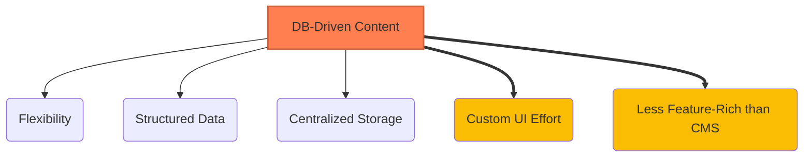

# Content Management Strategy

*Version: 1.0*
*Date: 2025-03-30*
*Author: Roo (AI Architect)*

## Status
Proposed - 2025-03-30

### Context
The Philosothon website needs to display dynamic content such as event themes, workshop descriptions, and FAQ items. This content may need updates by event organizers. A strategy is required for storing, managing, and retrieving this content for display on the Next.js frontend, balancing flexibility with implementation speed for the MVP.

### Decision Drivers
- **Flexibility**: Organizers need the ability to update content without requiring code changes or redeployments.
- **Structured Data**: Content needs to be structured (e.g., theme title, description, workshop facilitator) to be displayed correctly and potentially used for future features (filtering, relations).
- **MVP Speed**: The management interface needs to be simple and quick to implement within the 2-day timeline.
- **Integration**: Must integrate with the chosen backend (Supabase) and frontend (Next.js).

### Decision
We will adopt a **Database-Driven Content Management** approach using **Supabase** as the content store and a **Simple Custom Admin Interface** built within the Next.js application for content updates.

Key implementation aspects include:
- Storing content (themes, workshops, faq_items) in dedicated Supabase PostgreSQL tables as defined in the schema (§4.3).
- Creating protected API routes in Next.js (`/api/admin/content`) for authenticated administrators to update content records (e.g., PUT requests).
- Building basic forms within the protected `/admin` section of the Next.js app to allow admins to view and edit content records fetched from Supabase.
- Fetching content for public display using Next.js data fetching methods (SSG/ISR) via read-only API routes (`/api/content/*`) or direct Supabase queries server-side.

### Alternatives Considered
1.  **Markdown Files in Git Repository**:
    *   *Pros*: Simple for developers to update; version controlled via Git; works well with SSG.
    *   *Cons*: Requires developers for content updates; less accessible for non-technical organizers; harder to manage structured data relationships.
2.  **Headless CMS (e.g., Contentful, Strapi, Sanity)**:
    *   *Pros*: Provides a dedicated, user-friendly UI for content management; powerful features (content modeling, previews, localization).
    *   *Cons*: Introduces another external service and potential cost; adds complexity and learning curve; likely overkill for MVP needs; requires integration effort.
3.  **Direct Database Editing (e.g., via Supabase Studio/pgAdmin)**:
    *   *Pros*: No custom admin UI needed initially.
    *   *Cons*: Requires admins to interact directly with the database interface, which can be intimidating and error-prone; harder to enforce validation or specific workflows; potential security risks if access is not tightly controlled.

### Consequences
-   **Positive**:
    *   Content is centrally stored and managed in the primary database (Supabase).
    *   Provides flexibility for organizers to update content via a web interface.
    *   Structured data allows for easier querying and use in different parts of the application.
    *   Leverages existing technology choices (Next.js, Supabase, Tailwind) for the admin UI.
-   **Negative**:
    *   Requires development effort to build the custom admin interface (forms, API routes), even a simple one.
    *   The custom admin UI will likely be less feature-rich than a dedicated Headless CMS.
    *   Potential for performance issues in the admin UI if not implemented carefully (e.g., fetching large lists of content).
-   **Risks**:
    *   Admin UI development takes longer than anticipated, impacting MVP timeline.
    *   Security vulnerabilities in the custom admin API routes or UI if not properly secured.
    *   Lack of features like content preview or version history in the simple admin UI.
-   **Mitigations**:
    *   Keep the MVP admin UI extremely simple (basic CRUD forms for each content type).
    *   Thoroughly secure admin API routes using Supabase Auth checks (see ADR-Admin-Authentication).
    *   Implement basic validation on admin forms and API routes.
    *   Plan for potential enhancements to the admin UI post-MVP if needed.

### Implementation Details
-   **Database Tables**: Use `themes`, `workshops`, `faq_items` tables in Supabase as defined in Project Specs §4.3.
-   **Admin UI**: Create pages under `/admin/content/` (e.g., `/admin/content/themes`, `/admin/content/workshops`). Use simple HTML forms styled with Tailwind CSS. Fetch list data using SWR/React Query after auth check. Form submissions trigger PUT/POST requests to API routes.
-   **API Routes (Admin)**:
    *   `/api/admin/content/themes`: Handles GET (list), PUT (update), POST (create - maybe future), DELETE (maybe future). Requires admin auth check.
    *   `/api/admin/content/workshops`: Similar CRUD operations. Requires admin auth check.
    *   `/api/admin/content/faq`: Similar CRUD operations. Requires admin auth check.
-   **API Routes (Public)**:
    *   `/api/content/themes`: Handles GET (list). No auth required. Used by `getStaticProps`/`getServerSideProps`.
    *   `/api/content/workshops`: Handles GET (list). No auth required. Used by `getStaticProps`/`getServerSideProps`.
    *   (FAQ might be fetched directly server-side in `getStaticProps` for `/faq` page).
-   **Data Fetching (Public)**: Use `getStaticProps` (for SSG/ISR) or `getServerSideProps` (for SSR) on public pages to fetch content directly from Supabase using the service role key for optimal performance, bypassing public API routes where possible for build-time/server-side rendering.

### Security Considerations
-   **Authorization**: All admin API routes (`/api/admin/*`) MUST rigorously check for a valid, authenticated admin session using Supabase Auth before processing requests.
-   **Input Validation**: Sanitize and validate all data received from admin forms on the server-side (in API routes) before saving to the database to prevent injection attacks or data corruption.
-   **Rate Limiting**: Consider basic rate limiting on admin API routes if abuse is a concern.
-   **RLS**: While API routes perform auth checks, ensure Supabase RLS policies provide a second layer of defense, preventing unauthorized database modifications even if an API route vulnerability exists.

### Migration Path
-   **Short-term Plan**: Build the simple CRUD interface for MVP.
-   **Long-term Strategy**: If content management needs become significantly more complex (e.g., requiring rich text editing, image uploads, content previews, complex workflows, non-technical user roles), consider migrating to a dedicated Headless CMS (like Strapi self-hosted or Contentful/Sanity cloud-based) integrated with Supabase/Next.js. The structured data in Supabase makes this migration feasible.
-   **Rollback Plan**: If the custom admin UI proves unworkable, temporarily revert to direct database editing via Supabase Studio for admins as an emergency fallback, while addressing the UI issues.

### Success Metrics
-   **Content Update Time**: Admin can update a theme/workshop/FAQ item via the UI in < 5 minutes.
-   **Admin UI Errors**: Low rate of errors encountered by admins using the interface.
-   **Development Time**: Simple admin CRUD interface for core content types built within allocated MVP time (approx. 4-6 hours).

### Dependencies
-   **Depends on**: ADR-Supabase-Backend, ADR-Nextjs-Frontend-Framework, ADR-Admin-Authentication, ADR-Tailwind-CSS. Database schema definition.
-   **Influences**: Implementation of public-facing pages (data fetching), admin dashboard structure.

### Review Trigger
Re-evaluate this decision if:
-   Content update requirements become significantly more complex (e.g., rich text, workflows).
-   Non-technical users require a much more polished content editing experience than the simple custom UI provides.
-   Maintaining the custom admin UI becomes a significant burden.

### References
-   Project Specifications §3.3 (Content Management) ([docs/project_specifications.md](docs/project_specifications.md))
-   Project Specifications §4.2.1 (API Routes) ([docs/project_specifications.md](docs/project_specifications.md))
-   Project Specifications §4.3 (Database Schema) ([docs/project_specifications.md](docs/project_specifications.md))



```mermaid
flowchart LR
    subgraph "Admin User"
        Admin --> AdminUI[Admin UI (Next.js /admin)];
    end
    subgraph "Next.js App"
        AdminUI -- Reads/Writes --> AdminAPI[Admin API Routes (/api/admin/*)];
        PublicPages[Public Pages (SSG/ISR)] -- Reads --> PublicAPI[Public API Routes (/api/content/*)];
        PublicPages -- Reads Direct --> SupaDB[(Supabase DB)];
    end
    subgraph "Backend"
        AdminAPI -- Modifies --> SupaDB;
        PublicAPI -- Reads --> SupaDB;
    end

    AdminUI -- Auth Check --> SupaAuth[Supabase Auth];
    AdminAPI -- Auth Check --> SupaAuth;

    style SupaDB fill:#3ecf8e
    style SupaAuth fill:#4285f4
```

## Version History
| Version | Date       | Author        | Changes             |
|---------|------------|---------------|---------------------|
| 1.0     | 2025-03-30 | Roo (AI)      | Initial draft       |