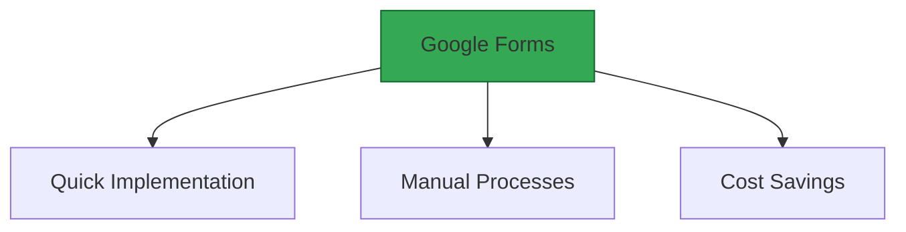

# Google Forms Registration System

## Status
Approved - 2025-03-30

### Context
Need a registration solution that:
- Can be implemented within 48 hours
- Supports complex question logic
- Requires minimal maintenance
- Integrates with existing Google Workspace

### Decision Drivers
- Time constraints for MVP launch
- Familiar interface for student participants
- Zero development overhead for form handling
- Compliance with university data policies

### Decision
Use Google Forms with:
- Embedded iframe on registration page
- Manual CSV export process
- Weekly data imports to Supabase
- Admin review interface

### Alternatives Considered
1. **Custom Form Builder**:
   - Pros: Full control over data flow
   - Cons: 2-week development timeline

2. **Typeform**:
   - Pros: Better UX
   - Cons: $29/month cost

3. **Airtable Forms**:
   - Pros: Direct database integration
   - Cons: Learning curve for admins

### Consequences
- **Positive**:
  - Operational within 4 hours
  - Built-in analytics and response tracking
  - Familiar tool for users

- **Negative**:
  - Manual data import process
  - Limited branding customization

- **Risks**:
  - Data entry errors during CSV handling
  - Google service outages

- **Mitigations**:
  - Implement checksum validation
  - Maintain local backup exports

### Dependencies
- **Depends on**: ADR-003 (Supabase Backend)
- **Influences**: ADR-006 (Data Flow Architecture)

### Review Trigger
Re-evaluate if:
- Registration volume exceeds 500 participants
- Data import errors occur >3 times/month

### Implementation Details
- Form embedded via responsive iframe (max-width: 800px)
- Weekly exports performed by event coordinator
- CSV sanitization using Python scripts before import
- Supabase pgAdmin interface for data validation

### Security Considerations
- Restricted to @utoronto.ca domain
- AES-256 encryption for CSV transfers
- PII limited to name and email in exports
- 30-day retention policy for raw data

### Migration Path
Phase 2 automation plan:
1. Google Sheets webhook integration
2. Automated data validation pipelines
3. Gradual transition to custom form:
   - Maintain Google Forms as fallback
   - Schema compatibility for 6 months

### References
- Project Specifications §3.1 (Registration System)
- Project Specifications §6.2 (Operations Processes)

```mermaid
flowchart LR
    Participants -->|Submit| GoogleForms
    GoogleForms -->|Data| GoogleSheets
    Admin -->|Export| CSV
    CSV -->|Import| Supabase
    Supabase --> AdminDashboard
    AdminDashboard -->|Team Formation| TeamAssignments
    TeamAssignments -->|Notification| Participants
    
    style GoogleForms fill:#34a853
    style Supabase fill:#3ecf8e
    style TeamAssignments fill:#fbbc04
```

