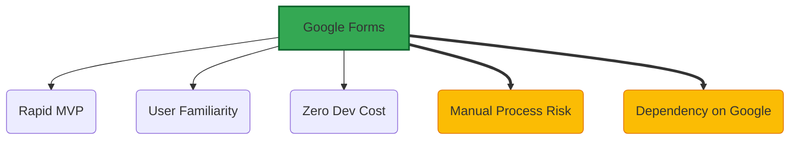
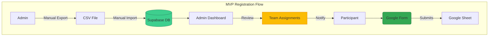

# Google Forms Registration System

*Version: 1.1*
*Date: 2025-03-30*
*Author: Roo (AI Architect)*

## Status
Approved - 2025-03-30

### Context
Need a registration solution for the Philosothon event platform that:
- Can be implemented within the 48-hour MVP development window.
- Supports complex question logic (ranked choices, conditional fields).
- Requires minimal maintenance and zero development overhead for form handling.
- Integrates easily with existing University Google Workspace infrastructure.
- Is familiar to student participants.

### Decision Drivers
- **Time Constraint**: Strict 2-day deadline for MVP launch.
- **Familiarity**: Students are accustomed to Google Forms, reducing friction.
- **Cost**: Free tier is sufficient for expected scale (~30 participants).
- **Features**: Native support for required question types (ranking, text, checkboxes).
- **Compliance**: Leverages existing University data handling practices via Google Workspace.

### Decision
We will use **Google Forms** for participant registration during the MVP phase, embedding the form directly into the Next.js website via an iframe. Data will be collected in Google Sheets and manually exported/imported into the Supabase database weekly.

Key implementation aspects include:
- Embedding the form using a responsive iframe.
- Designing the form with clear sections and instructions.
- Linking the form output to a dedicated Google Sheet.
- Establishing a manual weekly CSV export/import process.
- Utilizing Supabase admin interface for reviewing imported data.

### Alternatives Considered
1.  **Custom Form Builder (React Hook Form + API)**:
    *   *Pros*: Full control over UX and data flow; direct integration with Supabase.
    *   *Cons*: Estimated 2-week development time, significantly exceeding MVP timeline; requires backend API development.
2.  **Typeform**:
    *   *Pros*: Superior user experience and design customization.
    *   *Cons*: Requires paid subscription ($29/month+) for necessary features; introduces external dependency and cost.
3.  **Airtable Forms**:
    *   *Pros*: Direct integration potential with Airtable base (alternative backend); spreadsheet-like interface.
    *   *Cons*: Steeper learning curve for admins compared to Google Forms; potential API limitations.

### Consequences
-   **Positive**:
    *   Operational registration system achievable within ~4 hours.
    *   Leverages built-in Google Forms analytics and response tracking.
    *   High user familiarity reduces support needs.
    *   Zero direct cost for form hosting/submission handling.
-   **Negative**:
    *   Manual data export/import process is error-prone and time-consuming.
    *   Limited branding and styling customization within the embedded form.
    *   Dependency on Google services availability.
-   **Risks**:
    *   Data entry errors during manual CSV handling/import.
    *   Delays in data availability in the admin dashboard due to weekly import cycle.
    *   Potential Google service outages impacting registration availability.
-   **Mitigations**:
    *   Implement checksum validation script for CSV imports.
    *   Maintain local backups of Google Sheet exports.
    *   Develop clear documentation and training for the manual import process.
    *   Establish a communication plan for potential Google service outages (e.g., website banner).

### Implementation Details
-   **Form Embedding**: Use standard iframe embed code within a dedicated `/register` page component in Next.js. Ensure iframe `max-width: 800px` and responsive height.
-   **Validation**: Utilize Google Forms' built-in validation rules (required fields, email format, number ranges). Complex cross-field validation is not feasible in MVP.
-   **Export Process**: Event coordinator exports Google Sheet data to CSV weekly (e.g., every Friday EOD).
-   **Import Process**: Use a simple Python script (run manually by admin) to sanitize CSV (e.g., trim whitespace, basic format checks) before import via Supabase pgAdmin interface or a dedicated admin import function (Phase 1.5).
-   **Data Flow**: Participant -> Google Form -> Google Sheet -> Manual CSV Export -> Manual Sanitization -> Manual Supabase Import -> Admin Dashboard.

### Security Considerations
-   **Access Control**: Form restricted to users logged into `@utoronto.ca` Google accounts.
-   **Data Encryption**: Data encrypted in transit (HTTPS) by Google Forms and during CSV transfer (e.g., using encrypted storage or secure transfer methods).
-   **PII Handling**: Minimize PII collected; clearly state data usage purpose. PII in exports limited to name, email, program, year for team formation. Follow University data retention policies (e.g., delete raw export data after 30 days).
-   **Compliance**: Aligns with University FIPPA guidelines through use of approved Google Workspace tools. Consider GDPR principles for transparency and consent, although primary compliance is FIPPA.

### Migration Path
-   **Short-term Plan**: Implement manual process for MVP. Develop basic CSV sanitization script.
-   **Long-term Strategy (Phase 2)**:
    1.  Implement Google Apps Script or use a third-party tool (e.g., Zapier, Make) to trigger a webhook on form submission.
    2.  Develop a secure API endpoint in Next.js to receive webhook data.
    3.  Automate data validation, transformation, and insertion into Supabase.
    4.  Gradually transition to a custom React form component (Phase 4) while maintaining the Google Forms webhook as a fallback/parallel system during transition. Ensure schema compatibility.
-   **Rollback Plan**: If major issues arise with Google Forms, revert to a simple mailto: link for registration inquiries as an emergency fallback.

### Success Metrics
-   **Form Completion Rate**: Target > 90% completion rate for users who start the form.
-   **Abandonment Rate**: Target < 10% abandonment rate after starting the form.
-   **Data Import Errors**: Target < 5% error rate during manual import process per batch.
-   **Admin Time**: Track time spent on manual export/import; aim to reduce in Phase 2.

### Dependencies
-   **Depends on**: ADR-002 (Supabase Backend) for data storage.
-   **Influences**: ADR-005 (Admin Authentication - for accessing imported data), ADR-006 (Data Flow Architecture).

### Review Trigger
Re-evaluate this decision if:
-   Registration volume exceeds 100 participants (manual process becomes too burdensome).
-   Data import errors consistently exceed 10% per batch.
-   Significant Google Forms service outages occur more than once per month.
-   University policy regarding Google Workspace tools changes.

### References
-   Project Specifications §3.1 (Registration System) ([docs/project_specifications.md](docs/project_specifications.md))
-   Project Specifications §6.2 (Operations Processes) ([docs/project_specifications.md](docs/project_specifications.md))
-   University of Toronto FIPPA Guidelines ([Link to relevant UofT policy page])

## Version History
| Version | Date       | Author        | Changes                                                                 |
|---------|------------|---------------|-------------------------------------------------------------------------|
| 1.0     | 2025-03-30 | Roo (AI)      | Initial version based on project specs.                                   |
| 1.1     | 2025-03-30 | Roo (AI)      | Added Implementation, Security, Migration, Success Metrics, Version History sections based on user feedback. Expanded details on validation, privacy, fallbacks. |