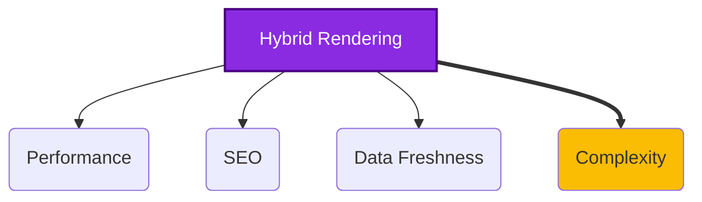

# Hybrid Rendering Strategy

*Version: 1.1*
*Date: 2025-03-30*
*Author: Roo (AI Architect)*

## Status
Approved - 2025-03-30

### Context
The Philosothon platform requires different rendering strategies for various page types to balance performance, SEO, and data freshness. Public content pages need to be fast and indexable, while admin areas require up-to-date data and secure access. Workshop listings need periodic updates without requiring a full site rebuild.

### Decision Drivers
- **Performance**: Achieve high Lighthouse scores and fast perceived load times (Core Web Vitals).
- **SEO**: Ensure public content pages (Home, About, Themes, FAQ, Workshops) are easily discoverable by search engines.
- **Data Freshness**: Admin dashboard needs near real-time data; workshop/theme info needs periodic updates.
- **Development Experience**: Leverage Next.js features effectively without excessive complexity.
- **Caching**: Balance caching benefits with the need for data updates.

### Decision
We will implement a **hybrid rendering strategy using Next.js capabilities**:
- **Static Site Generation (SSG)**: For primarily static public pages (`/`, `/about`, `/faq`, `/themes`). Build-time generation ensures maximum performance and SEO.
- **Server-Side Rendering (SSR)**: For protected admin pages (`/admin/*`). Ensures data is fresh on each request and allows server-side authentication checks before rendering.
- **Incremental Static Regeneration (ISR)**: For pages with content that updates periodically but not constantly (`/workshops`). Allows static generation benefits with background regeneration.
- **Client-Side Rendering (CSR)**: For highly interactive UI elements within pages (e.g., filtering controls, dynamic status updates after initial load) using libraries like SWR or React Query.

Key implementation aspects include:
- Using `getStaticProps` for SSG pages.
- Using `getServerSideProps` (with auth checks) for SSR admin pages.
- Using `getStaticProps` with the `revalidate` option for ISR pages.
- Fetching data client-side where appropriate after initial page load for dynamic UI updates.

### Alternatives Considered
1.  **Full SSG**:
    *   *Pros*: Maximum performance, simplest build output.
    *   *Cons*: Not suitable for dynamic admin data; requires full rebuild for any content update.
2.  **Full SSR**:
    *   *Pros*: Always serves fresh data.
    *   *Cons*: Slower initial load times compared to SSG; higher server load; less optimal for static content.
3.  **Client-Side Rendering (CSR) Only (e.g., standard React SPA)**:
    *   *Pros*: Rich interactivity, potentially simpler initial setup for developers familiar with SPAs.
    *   *Cons*: Poor initial load performance and SEO without pre-rendering; requires separate handling for static content generation.
4.  **Edge Runtime SSR (e.g., Next.js Middleware/Edge Functions)**:
    *   *Pros*: Very fast global delivery for dynamic content.
    *   *Cons*: Runtime limitations (e.g., no direct Node.js APIs, potential DB connection issues without specific drivers/proxies like Supabase Edge Functions); adds complexity.

### Consequences
-   **Positive**:
    *   Optimized performance tailored to each page type (fast static pages, fresh dynamic pages).
    *   Excellent SEO for public content.
    *   Efficient data fetching strategies (build-time, server-side, client-side).
    *   Leverages core Next.js strengths effectively.
    *   ISR provides balance between static performance and content updates.
-   **Negative**:
    *   Increased complexity compared to a single rendering strategy.
    *   Requires developers to understand different Next.js data fetching methods (`getStaticProps`, `getServerSideProps`, client-side).
    *   ISR introduces potential for briefly stale content between revalidations.
    *   Build times can increase with many SSG/ISR pages.
-   **Risks**:
    *   Serving stale content if ISR `revalidate` times are too long or background regeneration fails.
    *   Cache invalidation complexity if not relying on Next.js built-in mechanisms.
    *   Performance degradation on SSR pages if `getServerSideProps` is slow.
-   **Mitigations**:
    *   Set appropriate `revalidate` times for ISR based on content volatility (e.g., 6 hours for workshops seems reasonable initially).
    *   Monitor build times and Vercel function execution times.
    *   Implement efficient data fetching logic in `getServerSideProps`.
    *   Use `stale-while-revalidate` caching headers where appropriate for client-side fetched data.
    *   Implement robust error handling for data fetching methods.

### Implementation Details
-   **SSG Pages**: `/`, `/about`, `/faq`, `/themes`. Use `getStaticProps` to fetch content from Supabase at build time.
-   **SSR Pages**: `/admin/*`. Use `getServerSideProps` to check Supabase Auth status; redirect if not authenticated, otherwise fetch required admin data.
-   **ISR Pages**: `/workshops`. Use `getStaticProps` with `revalidate: 21600` (6 hours) to fetch workshop data from Supabase.
-   **Client-Side Fetching**: Use SWR or React Query within components for actions like filtering workshops/themes client-side after initial load, or fetching user-specific state in the admin dashboard.
-   **Data Fetching Library**: Use `@supabase/supabase-js` within Next.js data fetching functions and API routes.

### Security Considerations
-   **SSR Pages**: Crucially important to perform authentication/authorization checks within `getServerSideProps` before fetching or returning sensitive data for admin pages.
-   **SSG/ISR Pages**: These pages are built server-side and served statically; they should not contain user-specific or sensitive data unless it's fetched client-side after authentication. Ensure no sensitive data leaks into static page props.
-   **Caching**: Be mindful of caching headers (`Cache-Control`) set for API routes or SSR pages, especially those returning sensitive information. Vercel provides some default caching; override as needed.

### Migration Path
-   **Short-term Plan**: Implement rendering strategies as defined for MVP pages.
-   **Long-term Strategy**: Can adjust strategies per page as needed. E.g., an SSG page might become ISR if content updates more frequently. Could explore On-Demand ISR if Vercel plan supports it and fine-grained updates are needed. May adopt React Server Components more heavily in the future.
-   **Rollback Plan**: Change data fetching method for a specific page (e.g., switch ISR back to SSG by removing `revalidate`, switch SSR to client-side fetching). Requires code changes and redeployment.

### Success Metrics
-   **Lighthouse Performance Score**: Target > 95 for SSG/ISR pages, > 85 for SSR admin pages.
-   **Core Web Vitals**: All pages should pass Core Web Vitals assessment in Google Search Console.
-   **Time to Interactive (TTI)**: Monitor TTI for key pages.
-   **Build Time**: Keep production build times reasonable (e.g., < 5 minutes).

### Dependencies
-   **Depends on**: ADR-Nextjs-Frontend-Framework, ADR-Supabase-Backend (for data fetching).
-   **Influences**: Implementation of all page components, data fetching logic, deployment configuration (build process).

### Review Trigger
Re-evaluate this decision if:
-   Core Web Vitals scores consistently fail for key pages.
-   Build times become excessively long (> 10 minutes).
-   Content update requirements change drastically (e.g., needing real-time updates on currently static pages).
-   Next.js introduces fundamentally different recommended rendering patterns (e.g., widespread adoption of stable Server Components changes best practices).

### References
-   Project Specifications §3.3 (Rendering Strategy) ([docs/project_specifications.md](docs/project_specifications.md))
-   Project Specifications §4.1.3 (State Management) ([docs/project_specifications.md](docs/project_specifications.md))
-   Next.js Data Fetching Documentation: [https://nextjs.org/docs/basic-features/data-fetching/overview](https://nextjs.org/docs/basic-features/data-fetching/overview)
-   Next.js Rendering Overview: [https://nextjs.org/docs/basic-features/pages#rendering](https://nextjs.org/docs/basic-features/pages#rendering)



```mermaid
flowchart TD
    subgraph "Page Types"
        Static[Static Pages (/, /about, /faq)] -- SSG --> BuildTime[Build Time];
        Periodic[Periodic Content (/workshops)] -- ISR --> BuildTime & Revalidate[Build Time + Revalidation];
        Admin[Admin Pages (/admin/*)] -- SSR --> RequestTime[Request Time];
        InteractiveUI[Interactive UI (Filters)] -- CSR --> BrowserTime[Browser Runtime];
    end
    BuildTime --> EdgeCache[Edge Cache];
    Revalidate --> EdgeCache;
    RequestTime --> DynamicRender[Dynamic Render];
    BrowserTime --> DynamicRender;
    EdgeCache --> User;
    DynamicRender --> User;

    style Static fill:#34a853
    style Periodic fill:#fbbc04
    style Admin fill:#ea4335
    style InteractiveUI fill:#4285f4
```

## Version History
| Version | Date       | Author        | Changes                                                                 |
|---------|------------|---------------|-------------------------------------------------------------------------|
| 1.0     | 2025-03-30 | Unknown       | Initial version (from context file).                                    |
| 1.1     | 2025-03-30 | Roo (AI)      | Updated to match standard template; added Success Metrics, Version History, refined details. |