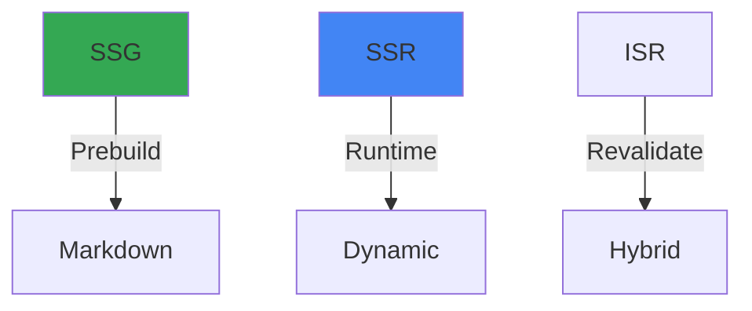

# Hybrid Rendering Strategy

## Status
Approved - 2025-03-30

### Context
Need to optimize page performance while maintaining dynamic content capabilities for:
- SEO-friendly public pages
- Admin dashboards requiring real-time data
- Complex workshop filtering interfaces

### Decision Drivers
- Google Core Web Vitals requirements
- Dynamic content update frequency
- Development team React expertise
- Caching complexity tradeoffs

### Decision
Implement Next.js hybrid rendering with:
- SSG for public content pages
- SSR for admin dashboards
- ISR for workshop listings
- Client-side fetching for UI states

### Alternatives Considered
1. **Full SSG**:
   - Pros: Maximum performance
   - Cons: No real-time updates

2. **CSR with React**:
   - Pros: Rich interactivity
   - Cons: Poor SEO performance

3. **Edge Runtime SSR**:
   - Pros: Fast global delivery
   - Cons: Limited database access

### Consequences
- **Positive**:
  - 95+ Lighthouse scores
  - Instant page transitions
  - Automatic cache invalidation

- **Negative**:
  - Build time complexity
  - Additional configuration

- **Risks**:
  - Stale content
  - Cache stampedes

- **Mitigations**:
  - Stale-while-revalidate
  - Sharded regeneration

### Dependencies
- **Depends on**: ADR-001 (Next.js Frontend)
- **Influences**: All page components

### Review Trigger
Reassess when:
- Page load times exceed 2s
- Content update frequency increases

### Implementation Details
- SSG for /about, /themes, /faq
- SSR for /admin/* routes
- ISR every 6h for /workshops
- SWR for client-side nav

### Security Considerations
- SSG pages have no auth
- SSR pages include auth checks
- Cache-control headers for sensitive data

### Migration Path
Progressive enhancement:
1. Add ISR to static pages
2. Introduce Edge API routes
3. Transition to React Server Components

### References
- Project Specifications §3.3 (Rendering Strategy)
- Project Specifications §4.1.3 (State Management)



```mermaid
flowchart LR
    User -->|Public| SSG
    Admin -->|Secure| SSR
    Database -->|Data| ISR
    style SSG fill:#34a853
    style SSR fill:#ea4335