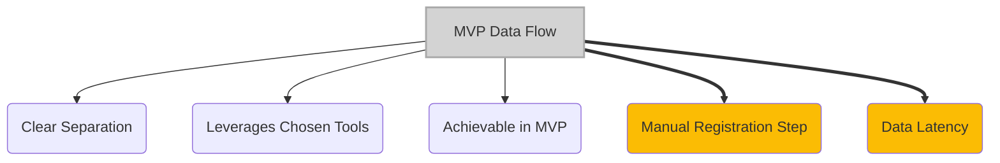
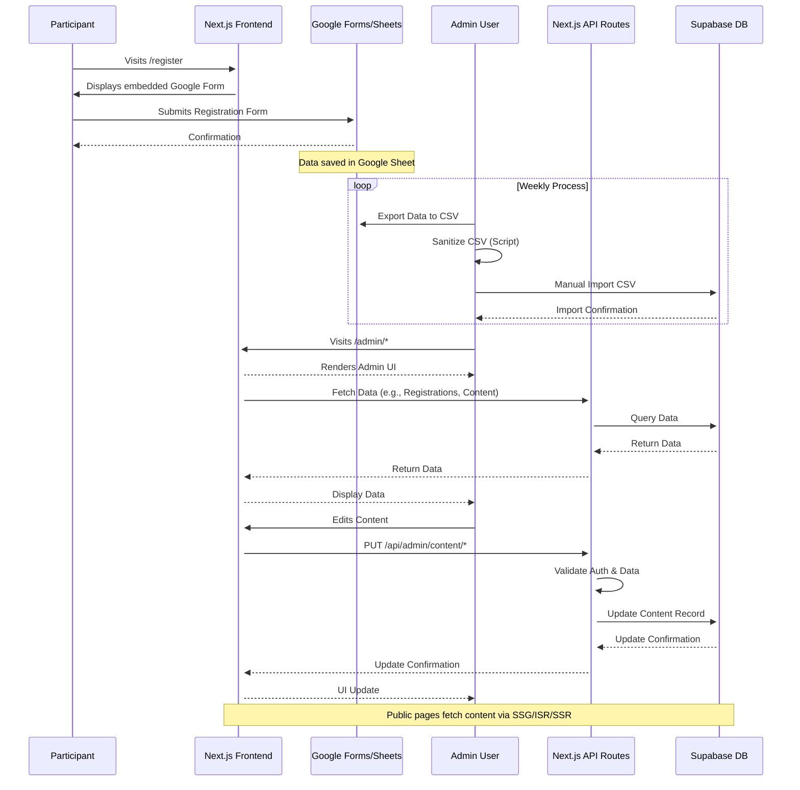

# MVP Data Flow Architecture

*Version: 1.0*
*Date: 2025-03-30*
*Author: Roo (AI Architect)*

## Status
Proposed - 2025-03-30

### Context
This ADR describes the end-to-end flow of key data within the Philosothon Event Platform for the Minimum Viable Product (MVP) phase. It focuses primarily on the flow of **registration data** (from participant submission to admin review) and **content data** (from storage to public display). Understanding these flows is crucial for ensuring components integrate correctly and data integrity is maintained, especially given the manual steps involved in the MVP registration process.

### Decision Drivers
- **Clarity**: Need a clear overview of how data moves between different system components (Google Forms, Next.js, Supabase, Admin).
- **MVP Constraints**: Architecture must reflect the decisions made for rapid implementation, including the manual registration data import.
- **Integration Points**: Identify key points where data is transferred or transformed between systems.
- **Maintainability**: Documenting the flow helps future developers understand the system.

### Decision
The MVP data flow will be characterized by two main streams:
1.  **Registration Data Flow**: Participants submit via embedded Google Form -> Data lands in Google Sheet -> Admin manually exports CSV -> Admin manually imports sanitized CSV into Supabase `registrations` table -> Admin views/manages data via protected Next.js Admin UI.
2.  **Content Data Flow**: Admin manages content (themes, workshops, FAQ) via protected Next.js Admin UI -> Updates are saved to Supabase tables (`themes`, `workshops`, `faq_items`) via Admin API routes -> Public Next.js pages fetch this content at build time (SSG/ISR) or request time (SSR) directly from Supabase for display.

Key implementation aspects include:
- Clear separation between the public content fetching path and the admin content/registration management path.
- Reliance on manual processes for the registration data transfer from Google Sheets to Supabase in MVP.
- Use of Next.js API routes for admin write operations and potentially for public read operations (though direct DB access server-side is preferred for performance).

### Alternatives Considered
1.  **Fully Automated Registration Flow (MVP)**: Using webhooks (Google Apps Script or Zapier) to push Google Form submissions directly to a Next.js API endpoint that writes to Supabase.
    *   *Pros*: Eliminates manual steps, real-time data availability.
    *   *Cons*: Significantly higher implementation complexity and time required, exceeding MVP constraints; adds more potential points of failure. Rejected per ADR-Google-Forms-Registration.
2.  **Content Managed via Git (Markdown)**: Storing content in Markdown files within the Git repository.
    *   *Pros*: Simpler data fetching for SSG; version controlled content.
    *   *Cons*: Requires developer intervention for content updates; less suitable for structured data relationships. Rejected per ADR-Content-Management-Strategy.

### Consequences
-   **Positive**:
    *   Achievable within the MVP timeline by deferring automation complexity.
    *   Clear separation of concerns between registration capture (Google) and platform display/management (Next.js/Supabase).
    *   Leverages strengths of chosen tools (Google Forms for complex forms, Supabase for structured data, Next.js for rendering).
-   **Negative**:
    *   Registration data in the admin dashboard is not real-time (updated weekly).
    *   Manual registration data import is labor-intensive and prone to human error.
    *   Potential for inconsistencies if manual processes are not followed carefully.
-   **Risks**:
    *   Errors during CSV export/import corrupting registration data.
    *   Delays in manual processing leading to outdated information for admins.
    *   Security risks if CSV files containing PII are handled insecurely during manual transfer.
-   **Mitigations**:
    *   Detailed documentation and checklist for the manual export/import process.
    *   CSV validation/sanitization script (as mentioned in ADR-Google-Forms-Registration).
    *   Secure handling procedures for exported CSV files (encryption, limited access).
    *   Regular audits comparing Google Sheet data with Supabase data.

### Implementation Details
-   **Registration Flow**:
    1.  Google Form embedded in `/register` page.
    2.  Submissions populate linked Google Sheet.
    3.  Weekly: Admin exports Sheet to CSV.
    4.  Weekly: Admin runs sanitization script on CSV.
    5.  Weekly: Admin uses Supabase Studio/pgAdmin or a simple custom import function (Phase 1.5) to upload CSV data into `registrations` table.
    6.  `/admin/registrations` page fetches data from Supabase `registrations` table.
-   **Content Flow**:
    1.  Admin accesses `/admin/content/*` pages.
    2.  UI fetches current content from Supabase via admin API routes or direct server-side calls.
    3.  Admin submits changes via forms.
    4.  Admin UI sends PUT/POST requests to `/api/admin/content/*` routes.
    5.  API routes validate data and update Supabase tables (`themes`, `workshops`, `faq_items`).
    6.  Public pages (`/themes`, `/workshops`, `/faq`) fetch data from Supabase using `getStaticProps` (with ISR for workshops). Vercel rebuilds/revalidates pages as needed.

### Security Considerations
-   **Registration Data Transfer**: The manual CSV transfer is a critical point. Ensure secure methods are used (e.g., encrypted transfer, deletion after import). Minimize PII in the export if possible.
-   **API Security**: Admin API routes for content/registration management must be strictly protected via authentication checks (ADR-Admin-Authentication). Public content API routes should be read-only.
-   **Database Access**: RLS policies in Supabase provide a crucial layer of defense for both content and registration data (ADR-Supabase-Backend).

### Migration Path
-   **Short-term Plan**: Implement manual registration flow and DB-driven content flow for MVP.
-   **Long-term Strategy (Phase 2+)**: Automate the registration flow using webhooks and API endpoints to eliminate manual CSV handling (as detailed in ADR-Google-Forms-Registration migration path). Content flow likely remains similar unless migrating to a Headless CMS (ADR-Content-Management-Strategy migration path).
-   **Rollback Plan**: Revert to previous database backups if data corruption occurs. If automation fails, revert to the documented manual process.

### Success Metrics
-   **Registration Data Latency**: Time between form submission and data availability in admin UI is within the expected weekly cycle.
-   **Data Integrity**: < 1% discrepancy rate between Google Sheet source and Supabase registration data after import.
-   **Content Update Propagation**: Content changes made via admin UI are reflected on the live site within the expected ISR revalidation window (e.g., 6 hours for workshops) or after the next build/deployment.

### Dependencies
-   **Depends on**: ADR-Google-Forms-Registration, ADR-Supabase-Backend, ADR-Admin-Authentication, ADR-Content-Management-Strategy, ADR-Nextjs-Frontend-Framework, ADR-Hybrid-Rendering.
-   **Influences**: Overall system integration testing, operational procedures documentation.

### Review Trigger
Re-evaluate this data flow if:
-   The manual registration import process proves unsustainable due to volume or error rate.
-   Real-time registration data becomes a critical requirement for admins.
-   The content structure or update frequency changes dramatically.

### References
-   Project Specifications §3.2 (High-Level Architecture) ([docs/project_specifications.md](docs/project_specifications.md))
-   Project Specifications §6.2 (Operations Processes) ([docs/project_specifications.md](docs/project_specifications.md))
-   All previously created ADRs for specific components.

## Version History
| Version | Date       | Author        | Changes             |
|---------|------------|---------------|---------------------|
| 1.0     | 2025-03-30 | Roo (AI)      | Initial draft       |