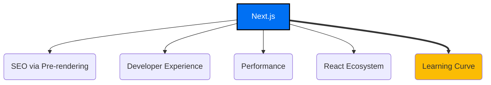
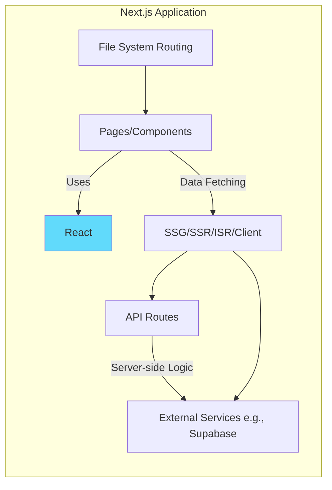

# Next.js Frontend Framework

*Version: 1.0*
*Date: 2025-03-30*
*Author: Roo (AI Architect)*

## Status
Proposed - 2025-03-30

### Context
The Philosothon Event Platform requires a modern, performant, and maintainable frontend framework to build the public-facing website and the simple admin interface. Key requirements include good SEO for public pages, efficient development workflow, and the ability to handle both static content and dynamic data fetching for admin areas.

### Decision Drivers
- **SEO Requirements**: Public information pages (Home, About, Themes, Workshops, FAQ) need to be easily indexable by search engines.
- **Development Efficiency**: The 2-day MVP timeline necessitates a framework that enables rapid development and iteration. File-based routing and integrated tooling are highly desirable.
- **Performance**: Need fast load times and good Core Web Vitals scores for user experience and SEO.
- **Team Expertise**: Development team has strong experience with React.
- **Future Scalability**: Architecture should accommodate future backend integration (API routes) and potentially more complex state management.

### Decision
We will use **Next.js** as the primary frontend framework for building the Philosothon Event Platform. We will leverage its hybrid rendering capabilities (SSG, SSR, ISR), file-based routing, integrated API routes, and React ecosystem compatibility.

Key implementation aspects include:
- Utilizing file-based routing (`pages` or `app` directory) for defining application routes.
- Employing Static Site Generation (SSG) for largely static content pages.
- Using Server-Side Rendering (SSR) or client-side fetching protected by authentication for admin pages.
- Leveraging API routes for backend interactions (e.g., communication with Supabase).

### Alternatives Considered
1.  **Create React App (CRA) / Vite + React (SPA)**:
    *   *Pros*: Mature ecosystem, strong team familiarity with React.
    *   *Cons*: Client-side rendering (CSR) by default, leading to poor initial SEO performance without pre-rendering solutions; requires separate routing library; no built-in API routes.
2.  **Static Site Generators (e.g., Gatsby, Astro)**:
    *   *Pros*: Excellent performance and SEO for static content; often integrate well with Markdown/CMS.
    *   *Cons*: Can be less flexible for highly dynamic applications or complex authenticated sections compared to Next.js; might require different paradigms for admin interface (e.g., separate SPA). Astro is newer, potentially smaller community support.
3.  **WordPress**:
    *   *Pros*: Very mature platform, vast plugin ecosystem, easy content management for non-technical users.
    *   *Cons*: Can be overkill for this project's scope; performance optimization can be challenging; less alignment with team's React expertise; potential security concerns with plugins.

### Consequences
-   **Positive**:
    *   Excellent SEO performance out-of-the-box due to pre-rendering options (SSG/SSR).
    *   Rapid development facilitated by file-based routing, Fast Refresh, and integrated tooling.
    *   Optimal performance through hybrid rendering strategies (documented in ADR-Hybrid-Rendering).
    *   Unified framework for both frontend and simple backend API needs (API routes).
    *   Leverages existing team expertise in React.
-   **Negative**:
    *   Can have a slightly steeper learning curve than basic React SPAs for understanding rendering methods and data fetching patterns.
    *   Build times can increase for larger sites with many SSG pages.
    *   Requires Node.js environment for development and deployment (managed by Vercel).
-   **Risks**:
    *   Over-complicating data fetching strategies if not carefully planned.
    *   Potential vendor lock-in with Vercel-specific features (though core Next.js is open-source).
-   **Mitigations**:
    *   Follow Next.js best practices for data fetching documented in ADR-Hybrid-Rendering.
    *   Utilize Incremental Static Regeneration (ISR) to manage build times for frequently updated static content.
    *   Prioritize standard Next.js features over Vercel-specific optimizations where possible if portability is a major long-term concern.

### Implementation Details
-   **Project Setup**: Initialize using `create-next-app`.
-   **Routing**: Use the `pages` directory router for simplicity in MVP (or `app` router if team prefers and understands its paradigms).
-   **Data Fetching**: Implement `getStaticProps` for SSG pages, `getServerSideProps` for SSR admin pages (or client-side fetching with SWR/React Query after auth check). See ADR-Hybrid-Rendering.
-   **API Routes**: Place backend logic interacting with Supabase within `/pages/api/*`.
-   **Styling**: Utilize Tailwind CSS (see ADR-TailwindCSS).
-   **State Management**: Primarily rely on React Context API for global state (e.g., theme, auth status) and server components/props for page data. Minimize client-side state.

### Security Considerations
-   **API Routes**: Secure API routes intended for admin use by checking Supabase authentication status server-side.
-   **Environment Variables**: Use Next.js built-in support for environment variables (`.env.local`) to store sensitive keys (e.g., Supabase service_role key). Ensure `NEXT_PUBLIC_` prefix is only used for non-sensitive, browser-exposed variables.
-   **Cross-Site Scripting (XSS)**: React/Next.js inherently mitigate some XSS risks through JSX encoding, but care must be taken when using `dangerouslySetInnerHTML` or handling user-generated content.
-   **Dependencies**: Keep Next.js and its dependencies updated to patch security vulnerabilities.

### Migration Path
-   **Short-term Plan**: Build MVP using the chosen routing and rendering strategies.
-   **Long-term Strategy**: Can incrementally adopt newer Next.js features (e.g., Server Components if starting with `pages` router). API routes can be expanded or migrated to dedicated backend services if complexity grows significantly.
-   **Rollback Plan**: Difficult to roll back framework choice entirely. Issues would likely be addressed by fixing implementation within Next.js or adjusting rendering/data fetching strategies.

### Success Metrics
-   **Lighthouse Performance Score**: Target > 90 for public pages.
-   **Development Time**: Achieve MVP frontend completion within the allocated 1.5 days (approx).
-   **SEO Ranking**: Monitor basic keyword ranking improvements post-launch.

### Dependencies
-   **Depends on**: React library knowledge.
-   **Influences**: ADR-Hybrid-Rendering, ADR-TailwindCSS, ADR-Vercel-Deployment, ADR-Admin-Authentication (integration with protected routes), ADR-Supabase-Backend (data fetching integration).

### Review Trigger
Re-evaluate this decision if:
-   Core requirements shift significantly towards a purely static site with no dynamic/admin features.
-   Performance issues arise that cannot be resolved through Next.js optimization techniques.
-   The need for complex, non-Node.js backend logic becomes primary.

### References
-   Project Specifications §3.1 (Frontend Framework) ([docs/project_specifications.md](docs/project_specifications.md))
-   Next.js Documentation: [https://nextjs.org/docs](https://nextjs.org/docs)

## Version History
| Version | Date       | Author        | Changes             |
|---------|------------|---------------|---------------------|
| 1.0     | 2025-03-30 | Roo (AI)      | Initial draft       |