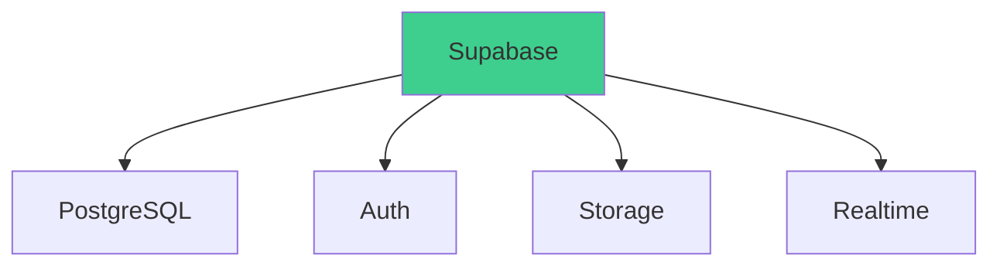

# Supabase Backend Service

## Status
Approved - 2025-03-30

### Context
Need a backend solution that:
- Supports rapid development
- Provides relational database capabilities
- Includes built-in authentication
- Scales cost-effectively

### Decision Drivers
- Small team size (3 developers)
- Need for real-time capabilities
- Future proofing for Phase 2 features
- University data security requirements

### Decision
Adopt Supabase with:
- PostgreSQL database
- Row-level security
- Email-only authentication
- RESTful API auto-generation

### Alternatives Considered
1. **Firebase**:
   - Pros: Strong real-time features
   - Cons: NoSQL limitations

2. **Custom Node.js API**:
   - Pros: Full control
   - Cons: 3-week development time

3. **Airtable**:
   - Pros: Spreadsheet-like interface
   - Cons: Poor API performance

### Consequences
- **Positive**:
  - Instant REST API endpoints
  - Built-in user authentication
  - Free tier sufficient for MVP

- **Negative**:
  - Vendor lock-in risk
  - Learning curve for PostgreSQL

- **Risks**:
  - Unforeseen scaling costs
  - Supabase service downtime

- **Mitigations**:
  - Regular database exports
  - Rate limiting implementation

### Dependencies
- **Depends on**: ADR-001 (Next.js Frontend)
- **Influences**: All data-dependent features

### Review Trigger
Reassess when:
- Daily active users exceed 1000
- Complex query requirements emerge

### Implementation Details
- Database schema designed with null constraints
- Row-level security policies for all tables
- pgAdmin for direct database access
- Serverless functions via Edge Runtime

### Security Considerations
- TLS 1.3 for all connections
- OWASP Top 10 protections enabled
- Weekly vulnerability scans
- Isolated test environment

### Migration Path
Future scalability plan:
1. Read replicas for high traffic
2. Connection pooling configuration
3. Gradual sharding if needed

### References
- Project Specifications §3.1 (Database)
- Project Specifications §4.3 (Database Schema)



```mermaid
flowchart TB
    NextJS -->|Client| Supabase
    Supabase -->|PostgreSQL| Database
    Admin -->|Auth| Supabase
    style Supabase fill:#3ecf8e