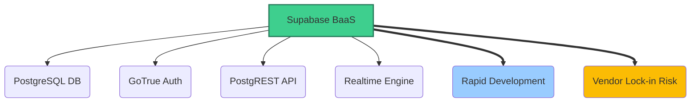

# Supabase Backend Service

*Version: 1.1*
*Date: 2025-03-30*
*Author: Roo (AI Architect)*

## Status
Approved - 2025-03-30

### Context
Need a backend-as-a-service (BaaS) solution for the Philosothon platform that:
- Supports rapid development for the 2-day MVP timeline.
- Provides a robust relational database (PostgreSQL).
- Includes built-in, secure authentication suitable for admin-only access initially.
- Offers auto-generated APIs to minimize backend coding effort.
- Scales cost-effectively from a small initial user base.

### Decision Drivers
- **Development Speed**: Need to minimize backend setup and API development time.
- **Team Expertise**: Team has strong React/Next.js skills, less dedicated backend experience.
- **Future Needs**: Anticipated future requirements for real-time features (notifications) and more complex data relationships (team formation, submissions).
- **Cost**: Free tier must be sufficient for MVP and initial event scale.
- **Security**: Must meet University data security requirements for handling potentially sensitive registration data (even if anonymized initially).

### Decision
We will adopt **Supabase** as the primary backend service, utilizing its integrated PostgreSQL database, authentication (Auth), auto-generated RESTful APIs (PostgREST), and potential for real-time subscriptions.

Key implementation aspects include:
- Using Supabase-managed PostgreSQL for all persistent data (content, registrations).
- Implementing Row-Level Security (RLS) policies on all tables containing sensitive data.
- Utilizing Supabase Auth for email-based magic link authentication for administrators.
- Interacting with the database primarily via the Supabase client libraries (`@supabase/supabase-js`) within Next.js API routes and server components.

### Alternatives Considered
1.  **Firebase (Firestore + Auth)**:
    *   *Pros*: Excellent real-time capabilities; mature ecosystem; generous free tier.
    *   *Cons*: NoSQL (Firestore) less ideal for relational event data (registrations, themes, workshops); potential query limitations compared to SQL.
2.  **Custom Node.js API (e.g., Express/NestJS + PostgreSQL)**:
    *   *Pros*: Full control over architecture, performance, and logic; no vendor lock-in.
    *   *Cons*: Estimated 3-week development time for basic API and auth, far exceeding MVP timeline; requires significant backend development and maintenance effort.
3.  **Airtable as Backend**:
    *   *Pros*: Very easy-to-use spreadsheet-like interface for data management; simple form integration.
    *   *Cons*: Not designed as a primary application backend; potential API rate limits and performance issues at scale; less robust querying capabilities than SQL.

### Consequences
-   **Positive**:
    *   Instant REST API endpoints generated directly from database schema, saving significant development time.
    *   Built-in, secure user authentication simplifies admin access control.
    *   Integrated PostgreSQL provides robust relational data modeling.
    *   Free tier is sufficient for MVP scale and likely the first few events.
    *   Real-time capabilities available for future features (Phase 2+).
-   **Negative**:
    *   Introduces vendor lock-in, although Supabase is built on open-source components (Postgres, PostgREST, GoTrue).
    *   Requires learning Supabase-specific concepts (RLS, client libraries).
    *   Potential learning curve for team members unfamiliar with PostgreSQL.
-   **Risks**:
    *   Unforeseen scaling costs if usage exceeds free tier limits unexpectedly.
    *   Supabase platform outages or service degradation impacting the application.
    *   Complexity in designing effective Row-Level Security policies.
-   **Mitigations**:
    *   Implement automated daily database backups via Supabase dashboard settings (point-in-time recovery available on paid plans). Supplement with periodic manual `pg_dump` exports for critical milestones.
    *   Monitor usage closely against free tier limits; establish budget for potential upgrade.
    *   Utilize Supabase status page and implement frontend error handling for backend unavailability.
    *   Conduct thorough testing of RLS policies.

### Implementation Details
-   **Database Schema**: Defined in `docs/project_specifications.md` §4.3. Enforce NOT NULL constraints and foreign keys where appropriate.
-   **RLS Policies**: Implement default-deny policies on tables like `registrations`. Grant specific SELECT, INSERT, UPDATE, DELETE permissions based on user roles (initially just 'admin' via Supabase Auth).
-   **Next.js Integration**:
    *   Use `@supabase/supabase-js` library for all interactions.
    *   Initialize Supabase client server-side (for API routes, server components) using service role key (stored securely in environment variables).
    *   Initialize Supabase client client-side (for browser interactions) using anon key.
    *   Fetch data in server components (`async function Page()`) or API routes. Use client-side fetching (e.g., SWR with Supabase client) for dynamic UI elements requiring user-specific data after login.
-   **Admin Access**: Use Supabase pgAdmin interface for direct database access during development and for emergency data management. Limit production direct access.
-   **Serverless Functions**: Utilize Supabase Edge Functions (Deno-based) for any complex backend logic not suitable for direct client-DB interaction or simple API routes (e.g., future automated import/validation).

### Security Considerations
-   **Connections**: Enforce TLS 1.3 for all database connections (Supabase default).
-   **Credentials**: Store Supabase API keys (anon, service_role) securely using environment variables (e.g., Vercel environment variables). Never expose service_role key client-side.
-   **RLS**: Primary mechanism for data access control within the database. Policies must be carefully crafted and tested.
-   **Vulnerability Scanning**: Rely on Supabase platform security; supplement with application-level security testing (e.g., OWASP ZAP scans against frontend/API).
-   **Backups**: Daily automated backups configured in Supabase. Retention period: 7 days (default free tier). Consider longer retention via manual exports or paid plan.
-   **Data Retention**: Implement application-level logic or database triggers/policies to enforce data retention requirements (e.g., anonymize or delete registration data after X months post-event, aligning with University policy).

### Migration Path
-   **Short-term Plan**: Implement core schema, RLS for admin access, and integrate client library in Next.js for MVP features.
-   **Long-term Strategy**:
    1.  Optimize complex queries using database views or functions.
    2.  Implement read replicas if read traffic becomes a bottleneck (requires paid plan).
    3.  Configure connection pooling (e.g., using Supavisor) if connection limits are reached (requires paid plan).
    4.  Consider database sharding only if single-node limits are exceeded (very unlikely scenario).
-   **Vendor Lock-in Mitigation**: Since Supabase uses standard PostgreSQL, migration to self-hosted Postgres or another managed provider is feasible. Requires replacing Supabase Auth and potentially rewriting RLS as application logic or different database policies. Regular `pg_dump` exports facilitate this.
-   **Rollback Plan**: Revert to previous database backup. Application code changes would need to be reverted via Git.

### Success Metrics
-   **API Response Time**: Target P95 response time < 200ms for common read queries (e.g., fetching themes, workshops).
-   **Database Connection Errors**: Monitor for connection errors; target < 0.1% error rate.
-   **Development Velocity**: Track time saved by not building custom backend API/auth (compare against estimate for custom build).
-   **Cost**: Remain within Supabase free tier limits for the first 6 months post-launch.

### Dependencies
-   **Depends on**: ADR-001 (Next.js Frontend - Assumed, needs creation) for client interaction.
-   **Influences**: ADR-004 (Admin Authentication), ADR-006 (Data Flow Architecture), All data-driven features (Content Management, Registration Display, Future Team Formation).

### Review Trigger
Reassess this decision if:
-   Daily active users consistently exceed 1000 (may require performance optimization or plan upgrade).
-   Query complexity significantly increases, requiring features beyond basic SQL/PostgREST capabilities.
-   Supabase pricing model changes detrimentally or service reliability degrades significantly.
-   Core application requirements shift away from a relational data model.

### References
-   Project Specifications §3.1 (Database) ([docs/project_specifications.md](docs/project_specifications.md))
-   Project Specifications §4.3 (Database Schema) ([docs/project_specifications.md](docs/project_specifications.md))
-   Supabase Documentation: [https://supabase.com/docs](https://supabase.com/docs)
-   Supabase Row Level Security: [https://supabase.com/docs/guides/auth/row-level-security](https://supabase.com/docs/guides/auth/row-level-security)
-   Supabase Backups: [https://supabase.com/docs/guides/platform/backups](https://supabase.com/docs/guides/platform/backups)



```mermaid
flowchart LR
    subgraph "Next.js Frontend"
        direction TB
        Browser --> ClientComp[Client Components];
        Server --> ServerComp[Server Components];
        Server --> APIRoute[API Routes];
    end

    subgraph "Supabase Backend"
        direction TB
        Auth[Auth (GoTrue)]
        DB[(PostgreSQL DB + RLS)]
        API[Auto-Generated API (PostgREST)]
        RT[Realtime Engine]
    end

    ClientComp -- `@supabase/js` --> Auth;
    ClientComp -- `@supabase/js` --> API;
    ClientComp -- `@supabase/js` --> RT;
    ServerComp -- `@supabase/js (Service Key)` --> DB;
    APIRoute -- `@supabase/js (Service Key)` --> DB;
    API -- Reads/Writes --> DB;
    Auth -- Manages Users --> DB;

    style DB fill:#3ecf8e,stroke:#277c5c
```

## Version History
| Version | Date       | Author        | Changes                                                                 |
|---------|------------|---------------|-------------------------------------------------------------------------|
| 1.0     | 2025-03-30 | Roo (AI)      | Initial version based on project specs.                                   |
| 1.1     | 2025-03-30 | Roo (AI)      | Added Implementation, Security, Migration, Success Metrics, Version History sections. Expanded details on backups, retention, Next.js integration, performance. |