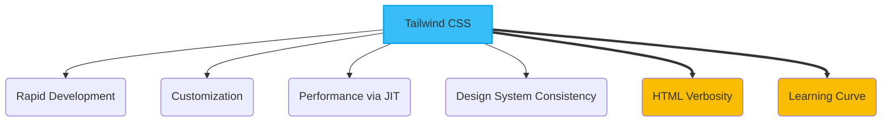
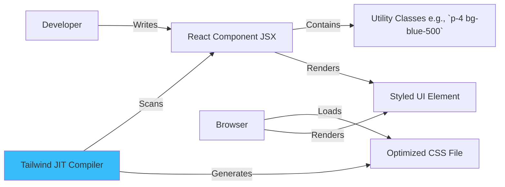

# Tailwind CSS UI Framework

*Version: 1.0*
*Date: 2025-03-30*
*Author: Roo (AI Architect)*

## Status
Proposed - 2025-03-30

### Context
The Philosothon Event Platform requires a styling solution for the Next.js frontend that enables rapid development, ensures consistency, is highly customizable, and performs well. The team needs to build both public-facing pages and a simple admin interface within a tight timeframe.

### Decision Drivers
- **Development Speed**: The 2-day MVP timeline demands a styling approach that minimizes context switching and allows for quick iteration directly within the markup.
- **Customization**: Need the ability to implement the specific design system (colors, typography) defined in the project specifications (§4.4) without fighting framework defaults.
- **Performance**: Avoid shipping unused CSS to the client; minimize CSS bundle size.
- **Maintainability**: Utility-first approach can lead to consistent styling application, especially with component-based frameworks like React/Next.js.
- **AI Assistance**: The project specifications note Tailwind CSS works well with AI code assistance (§3.1), potentially speeding up component styling.

### Decision
We will use **Tailwind CSS** as the primary CSS framework for styling the Next.js application. We will leverage its utility-first approach, JIT (Just-In-Time) compiler for performance, and configuration options to implement the project's design system.

Key implementation aspects include:
- Installing and configuring Tailwind CSS within the Next.js project.
- Defining the project's color palette, fonts, and spacing in `tailwind.config.js`.
- Applying utility classes directly to HTML/JSX elements for styling.
- Extracting reusable component styles using `@apply` or by creating dedicated React components with pre-applied styles where appropriate.

### Alternatives Considered
1.  **Component Libraries (e.g., Material UI, Chakra UI, Bootstrap)**:
    *   *Pros*: Provide pre-built, accessible components, potentially speeding up development initially; enforce design consistency.
    *   *Cons*: Can be harder to customize to a specific design system; often ship with significant JavaScript, potentially impacting performance; may introduce opinions about component structure.
2.  **CSS Modules / Styled Components / Emotion (CSS-in-JS)**:
    *   *Pros*: Scoped styling prevents class name collisions; allows dynamic styling based on props; leverages JavaScript for styling logic.
    *   *Cons*: Can involve more context switching between markup and styles; potentially larger runtime overhead compared to utility classes; CSS Modules lack easy reuse of styles across components without composition.
3.  **Plain CSS / SASS**:
    *   *Pros*: Full control, no framework overhead.
    *   *Cons*: Requires manual creation of design system utilities and components; higher risk of inconsistent styling; potentially slower development speed for MVP without established conventions.

### Consequences
-   **Positive**:
    *   Rapid styling directly in markup, reducing context switching.
    *   Highly optimized CSS output due to JIT compiler (only generates used styles).
    *   Easy implementation and enforcement of the project's specific design system via configuration.
    *   Excellent compatibility with component-based architecture (React/Next.js).
    *   Potentially faster styling with AI code completion tools familiar with Tailwind.
-   **Negative**:
    *   Can lead to verbose HTML/JSX with many utility classes, potentially impacting readability for those unfamiliar.
    *   Requires learning the utility class names and Tailwind's conventions.
    *   Initial setup and configuration required.
-   **Risks**:
    *   Inconsistent application of utilities if component abstraction isn't used for complex elements.
    *   Potential for large configuration files if not managed well.
-   **Mitigations**:
    *   Encourage creation of reusable React components for complex UI elements to encapsulate styling logic.
    *   Use Tailwind plugins or `@apply` sparingly for common style combinations.
    *   Provide team training or resources on Tailwind best practices.
    *   Regularly review `tailwind.config.js` for clarity and organization.

### Implementation Details
-   **Installation**: Follow official Next.js + Tailwind CSS installation guide.
-   **Configuration (`tailwind.config.js`)**:
    *   Define `theme.extend` with colors, fonts (serif, sans-serif, mono), and potentially spacing/breakpoints from project specs (§4.4).
    *   Ensure content paths correctly scan all relevant component/page files.
-   **Base Styles**: Use a global CSS file (`globals.css`) for base element styles (e.g., body background, font smoothing) and potentially `@layer base` directives.
-   **Component Styling**: Apply utilities directly in JSX. For repeated patterns (e.g., buttons, cards), create React components that accept props for variations but encapsulate the core Tailwind classes.
-   **Purging**: Handled automatically by the JIT compiler based on scanned file content.

### Security Considerations
-   Tailwind CSS itself has minimal direct security implications as it primarily generates static CSS.
-   Indirectly, ensure that any dynamic class generation based on user input is properly sanitized to prevent potential injection vulnerabilities (though this is generally an application logic concern, not specific to Tailwind).

### Migration Path
-   **Short-term Plan**: Implement all MVP styling using Tailwind utilities and configuration.
-   **Long-term Strategy**: Continue using Tailwind. If needed, introduce a complementary component library (e.g., Headless UI) that integrates well with Tailwind for complex interactive elements (modals, dropdowns) while maintaining styling control.
-   **Rollback Plan**: Extremely difficult to roll back entirely. Would require rewriting all styling using a different methodology (e.g., CSS Modules, plain CSS). Issues would likely be addressed by refactoring components or adjusting Tailwind usage patterns.

### Success Metrics
-   **Styling Development Time**: Subjective measure - team feedback indicates faster styling compared to previous methods.
-   **CSS Bundle Size**: Keep production CSS bundle size minimal (e.g., < 50KB gzipped).
-   **Design Consistency**: Visual review confirms consistent application of design system across pages/components.

### Dependencies
-   **Depends on**: ADR-Nextjs-Frontend-Framework. Requires Node.js/npm environment.
-   **Influences**: All frontend components and pages.

### Review Trigger
Re-evaluate this decision if:
-   Team productivity significantly decreases due to Tailwind's learning curve or verbosity.
-   Performance issues arise specifically related to CSS parsing/rendering that cannot be resolved with Tailwind optimizations.
-   A need arises for complex, themeable components that are significantly easier to implement with a pre-built component library.

### References
-   Project Specifications §3.1 (UI Framework) ([docs/project_specifications.md](docs/project_specifications.md))
-   Tailwind CSS Documentation: [https://tailwindcss.com/docs](https://tailwindcss.com/docs)
-   Tailwind CSS with Next.js Guide: [https://tailwindcss.com/docs/guides/nextjs](https://tailwindcss.com/docs/guides/nextjs)

## Version History
| Version | Date       | Author        | Changes             |
|---------|------------|---------------|---------------------|
| 1.0     | 2025-03-30 | Roo (AI)      | Initial draft       |