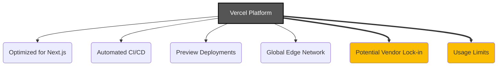

# Vercel Deployment Platform

*Version: 1.0*
*Date: 2025-03-30*
*Author: Roo (AI Architect)*

## Status
Proposed - 2025-03-30

### Context
The Philosothon Event Platform, built with Next.js, requires a reliable, performant, and easy-to-use platform for deployment and hosting. Key requirements include seamless integration with Next.js features, automated deployments from a Git repository, preview deployments for reviewing changes, and cost-effectiveness for a small-scale event website.

### Decision Drivers
- **Next.js Optimization**: Need a platform specifically optimized for hosting Next.js applications, handling its various rendering modes (SSG, SSR, ISR, API routes) efficiently.
- **Developer Experience**: Desire for automated CI/CD pipeline triggered by Git pushes, easy configuration, and fast deployments.
- **Preview Deployments**: Need the ability to easily preview changes from feature branches before merging to production.
- **Performance**: Global CDN and edge network required for fast content delivery worldwide.
- **Cost**: Free tier must be sufficient for MVP and initial event traffic.

### Decision
We will use **Vercel** as the deployment and hosting platform for the Next.js application. We will leverage its direct integration with GitHub, automated CI/CD pipeline, preview deployments, global edge network, and optimizations specifically for Next.js.

Key implementation aspects include:
- Connecting the project's GitHub repository to a Vercel project.
- Configuring build settings and environment variables within the Vercel dashboard.
- Utilizing Vercel's automatic deployments for the main branch (production) and preview deployments for pull requests/feature branches.
- Mapping a custom domain to the Vercel deployment.

### Alternatives Considered
1.  **Netlify**:
    *   *Pros*: Strong competitor, also offers Git integration, CI/CD, preview deployments, global CDN, generous free tier. Good support for various frameworks.
    *   *Cons*: While support for Next.js is good, Vercel (as the creators of Next.js) often has tighter integration and day-one support for new Next.js features. Potential complexities with certain Next.js features like middleware or ISR compared to Vercel.
2.  **AWS (e.g., Amplify, S3+CloudFront+Lambda@Edge)**:
    *   *Pros*: Highly scalable, flexible, part of the extensive AWS ecosystem.
    *   *Cons*: Significantly more complex configuration and steeper learning curve compared to Vercel/Netlify; potentially higher cost if not managed carefully; requires manual setup of CI/CD pipeline and CDN.
3.  **GitHub Pages**:
    *   *Pros*: Free, simple for purely static sites, directly integrated with GitHub.
    *   *Cons*: Primarily designed for static sites; does not support SSR, ISR, or API routes required by Next.js dynamic features and admin interface.
4.  **Self-Hosting (e.g., Docker on VPS)**:
    *   *Pros*: Full control over the environment.
    *   *Cons*: Requires significant infrastructure management (server setup, maintenance, security, scaling, CI/CD pipeline); higher operational overhead and cost; slower deployment cycles.

### Consequences
-   **Positive**:
    *   Extremely simple and fast deployment process optimized for Next.js.
    *   Automated CI/CD pipeline integrated with GitHub.
    *   Preview deployments significantly improve the development and review workflow.
    *   High performance due to Vercel's global edge network and Next.js optimizations.
    *   Free tier is sufficient for MVP needs.
    *   Automatic HTTPS/SSL certificate management.
-   **Negative**:
    *   Potential vendor lock-in specifically with Vercel's platform features (though the Next.js app itself remains portable).
    *   Usage limits on the free tier (bandwidth, build minutes, serverless function execution) could be exceeded as the site grows, requiring an upgrade to a paid plan.
-   **Risks**:
    *   Vercel platform outages impacting site availability.
    *   Unexpected costs if usage spikes significantly beyond free tier limits.
-   **Mitigations**:
    *   Monitor Vercel status page. Application designed to degrade gracefully if backend (Supabase) is unavailable, but Vercel outage affects frontend delivery.
    *   Monitor usage analytics within the Vercel dashboard. Set up billing alerts if upgrading to a paid plan.
    *   Ensure critical environment variables are securely stored in Vercel.

### Implementation Details
-   **Connection**: Link GitHub repository (`main` branch for production, feature branches for previews).
-   **Build Command**: Default Next.js build command (`next build`) usually detected automatically.
-   **Output Directory**: `.next` (usually detected automatically).
-   **Environment Variables**: Add Supabase keys (`NEXT_PUBLIC_SUPABASE_URL`, `NEXT_PUBLIC_SUPABASE_ANON_KEY`, `SUPABASE_SERVICE_ROLE_KEY`) via Vercel project settings. Ensure `SUPABASE_SERVICE_ROLE_KEY` is NOT prefixed with `NEXT_PUBLIC_`.
-   **Custom Domain**: Configure custom domain (e.g., `philosothon.toronto.edu` - requires DNS changes) via Vercel dashboard after launch.

### Security Considerations
-   **Environment Variables**: Use Vercel's system for securely storing backend keys and other secrets. Do not commit secrets to Git.
-   **Preview Deployments**: Be aware that preview deployments might be publicly accessible by default (though with obscure URLs). Configure Vercel's access protection features (e.g., password protection, Vercel authentication) for preview deployments if sensitive pre-release content is involved.
-   **Permissions**: Manage Vercel team permissions carefully to control who can deploy or change project settings.
-   **DDoS Protection**: Vercel provides basic DDoS mitigation.

### Migration Path
-   **Short-term Plan**: Deploy MVP to Vercel.
-   **Long-term Strategy**: Continue using Vercel as long as it meets performance and cost requirements. If migration is needed (e.g., due to cost, features), the Next.js application can be deployed to other platforms supporting Node.js (e.g., Netlify, AWS Amplify, Docker container), though some Vercel-specific optimizations might be lost or require reconfiguration.
-   **Rollback Plan**: Vercel keeps previous deployments. Rolling back to a prior production deployment is straightforward via the Vercel dashboard.

### Success Metrics
-   **Deployment Time**: Target average deployment time < 5 minutes.
-   **Uptime**: Target > 99.9% uptime for the production deployment (monitored via Vercel analytics or external tool).
-   **Preview Deployment Usage**: Team actively uses preview deployments for PR reviews.

### Dependencies
-   **Depends on**: ADR-Nextjs-Frontend-Framework. Requires a Git repository (GitHub recommended).
-   **Influences**: CI/CD workflow, environment variable management.

### Review Trigger
Re-evaluate this decision if:
-   Vercel costs become prohibitive for the project budget.
-   Significant reliability issues or outages occur with the Vercel platform.
-   Core requirements necessitate features only available on other platforms (e.g., complex custom server configurations not supported by Vercel).
-   The application moves away from Next.js entirely.

### References
-   Project Specifications §3.1 (Deployment) ([docs/project_specifications.md](docs/project_specifications.md))
-   Vercel Documentation: [https://vercel.com/docs](https://vercel.com/docs)
-   Deploying Next.js on Vercel: [https://nextjs.org/docs/deployment](https://nextjs.org/docs/deployment)



```mermaid
flowchart LR
    Dev[Developer] -- Pushes Code --> GitHub[GitHub Repo];
    GitHub -- Triggers Webhook --> Vercel[Vercel Platform];
    Vercel -- Builds --> Build[Next.js Build];
    Build -- Deploys --> Edge[Vercel Edge Network];
    Edge -- Serves --> User[End User Browser];
    Vercel -- Creates --> Preview[Preview Deployment (for PRs)];

    style Vercel fill:#555, color:#fff
```

## Version History
| Version | Date       | Author        | Changes             |
|---------|------------|---------------|---------------------|
| 1.0     | 2025-03-30 | Roo (AI)      | Initial draft       |