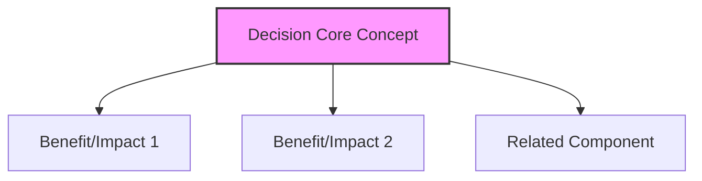
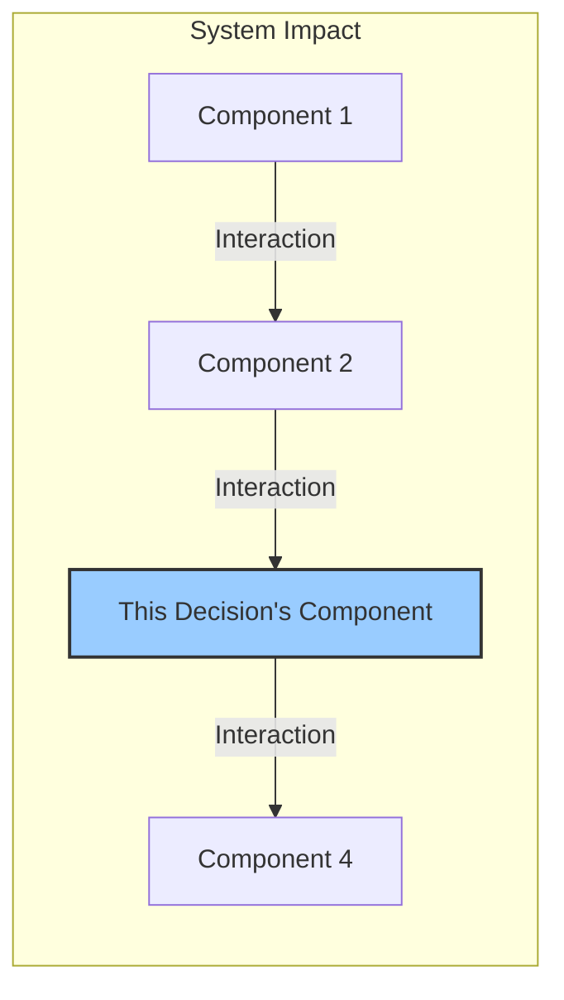

# [TITLE OF THE DECISION RECORD]

*Version: 1.0*
*Date: YYYY-MM-DD*
*Author: [Author Name]*

## Status
[Proposed | Approved | Deprecated | Superseded by ADR-XXX] - YYYY-MM-DD

### Context
[Describe the issue, problem, or challenge this ADR addresses. What is the background? Why is a decision needed now? What are the key constraints (e.g., time, resources, existing architecture)?]

### Decision Drivers
- [Driver 1: e.g., Performance requirement > X ms]
- [Driver 2: e.g., Need for rapid development (MVP deadline)]
- [Driver 3: e.g., Compliance with University Data Policy Y]
- [...]

### Decision
We will use **[Chosen Technology/Approach/Pattern]** to **[Address the core problem/achieve the primary goal]** because **[Primary justification, linking back to drivers]**.

Key implementation aspects include:
- [Specific configuration detail 1]
- [Architectural pattern detail 2]
- [Integration point detail 3]
- [...]

### Alternatives Considered
1.  **[Alternative Option 1]**: [Brief description]
    *   *Pros*: [Advantages]
    *   *Cons*: [Disadvantages]
2.  **[Alternative Option 2]**: [Brief description]
    *   *Pros*: [Advantages]
    *   *Cons*: [Disadvantages]
3.  **[Status Quo / Do Nothing]**: [Describe the current state if no change is made]
    *   *Pros*: [Advantages, e.g., no immediate effort]
    *   *Cons*: [Disadvantages, e.g., problem persists]

### Consequences
-   **Positive**: [What benefits does this decision create? (e.g., Improved performance, faster development, better security)]
-   **Negative**: [What tradeoffs or costs does this introduce? (e.g., Increased complexity, vendor lock-in, learning curve)]
-   **Risks**: [What could go wrong with this decision? (e.g., Technology becomes unsupported, integration issues, unforeseen costs)]
-   **Mitigations**: [How will we address or minimize the identified risks? (e.g., Regular backups, monitoring, fallback plan)]

### Implementation Details
[Provide specific technical details on how this decision will be put into practice.]
-   **Configuration**: [e.g., Specific settings, environment variables]
-   **Code Patterns/Libraries**: [e.g., Use of specific design patterns, required libraries]
-   **Integration Points**: [e.g., How it connects with Component X via API Y]
-   **Infrastructure**: [e.g., Required database changes, new services needed]
-   **Process Changes**: [e.g., New deployment steps, required team training]

### Security Considerations
[How does this decision impact system security?]
-   **Authentication/Authorization**: [e.g., Impact on user login, admin access]
-   **Data Protection**: [e.g., Handling of PII, encryption requirements, data storage implications]
-   **Compliance**: [e.g., Adherence to FIPPA, GDPR, University policies]
-   **Attack Surface**: [e.g., Potential new vulnerabilities introduced or mitigated]
-   **Auditing**: [e.g., Logging requirements for security events]

### Migration Path
[How will we evolve this solution or transition to it?]
-   **Short-term Plan**: [e.g., Steps for initial implementation, feature flags]
-   **Long-term Strategy**: [e.g., Future enhancements, potential replacements]
-   **Backward Compatibility**: [e.g., How will this interact with older systems/data?]
-   **Rollback Plan**: [e.g., Steps to revert the decision if necessary]

### Success Metrics
[How will we know if this decision was successful?]
-   [Metric 1: e.g., Page load time < 500ms for 95th percentile]
-   [Metric 2: e.g., Reduction in admin errors related to X by 20%]
-   [Metric 3: e.g., Successful processing of Y registrations per hour]

### Dependencies
-   **Depends on**: [ADRs or specifications this decision relies on (e.g., ADR-002 Supabase Backend)]
-   **Influences**: [Future decisions or components impacted by this one (e.g., ADR-005 Admin UI)]

### Review Trigger
This decision should be revisited if/when:
-   [Condition 1: e.g., Daily active users exceed 1000]
-   [Condition 2: e.g., Core dependency (e.g., Supabase) changes its pricing model significantly]
-   [Condition 3: e.g., University security policy is updated]

### References
-   Related to Project Specifications §[Section Number] ([docs/project_specifications.md](docs/project_specifications.md))
-   [Link to relevant external documentation, standard, or research paper]
-   [Link to related internal document/wiki page]

## Version History
| Version | Date       | Author        | Changes                                            |
|---------|------------|---------------|----------------------------------------------------|
| 1.0     | YYYY-MM-DD | [Author Name] | Initial draft                                      |
| 1.1     | YYYY-MM-DD | [Author Name] | [e.g., Added security considerations based on review] |