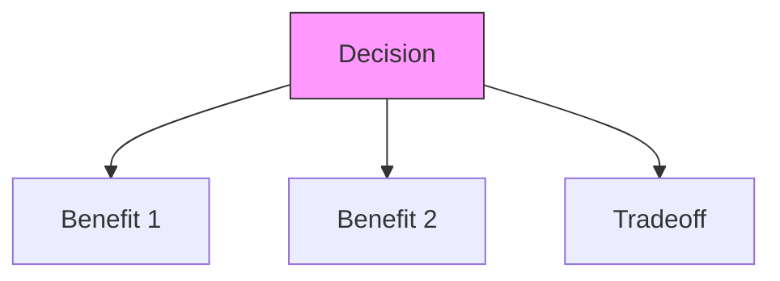
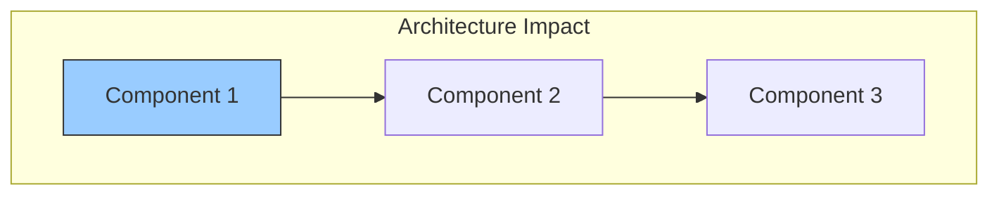

# [TITLE]

## Status
[Proposed/Approved/Deprecated] - YYYY-MM-DD

### Context
[What is the issue we're addressing? Why is this decision needed?]

### Decision Drivers
- [Key factor 1 influencing the decision]
- [Key factor 2 influencing the decision]

### Decision
[What are we choosing to do? State this in positive terms]

### Alternatives Considered
1. [Option 1] - [Brief description]
2. [Option 2] - [Brief description]
3. [Status Quo] - [What happens if we do nothing?]

### Consequences
- **Positive**: [What benefits does this decision create?]
- **Negative**: [What tradeoffs or costs does this introduce?]
- **Risks**: [What could go wrong?]
- **Mitigations**: [How will we address risks?]

### Dependencies
- **Depends on**: [Related ADRs or specifications]
- **Influences**: [Future decisions impacted]

### Review Trigger
This decision should be revisited when:
- [Condition 1]
- [Condition 2]

### References
- Related to [Section X.Y] in [Project Specifications](project_specifications.md)
- Influenced by [External Reference/Standard]

