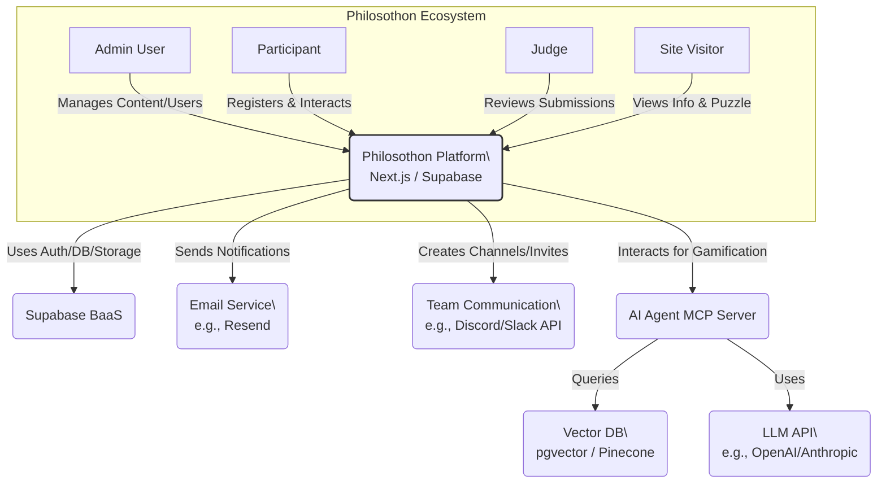

# C4 Model: Level 1 - System Context (V2)

* Date: 2025-04-19
* Description: High-level overview showing users interacting with the Philosothon Platform V2 and its key external dependencies.

**Notes:**
*   Shows the primary system boundaries and external dependencies for the V2 platform.
*   The AI Agent MCP Server, Vector DB, and LLM API are key new external dependencies supporting the gamification features.
*   Team Communication integration (Discord/Slack) is another new external dependency.