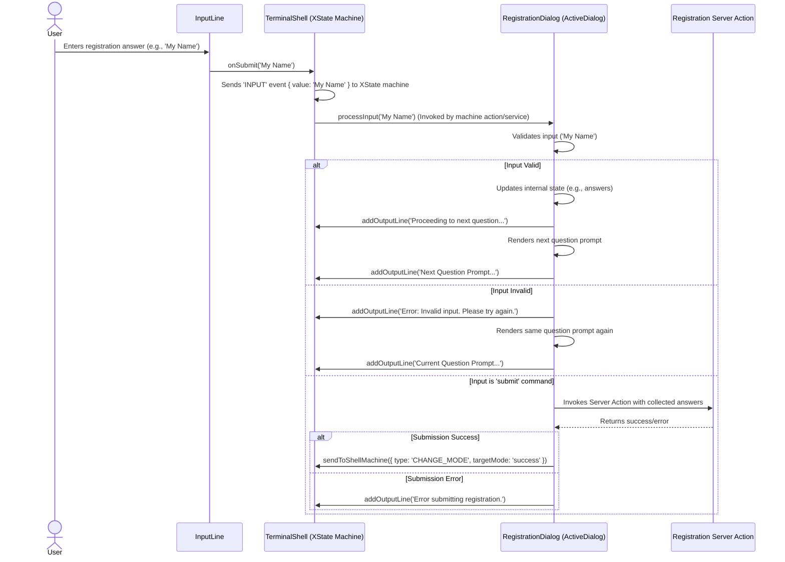

# Architecture: Modular Terminal Component (V2)

**Version:** 2.0
**Date:** 2025-04-23
**Author:** Architect Mode

## 1. Overview

This document outlines the V2 architecture for the modular and extensible terminal UI component in React, evolving from V1 architecture. This version addresses the significantly expanded scope required by Project Specification V3.0, including registration, authentication, status viewing, submissions, document library, chatbot, and gamification, while refining state management and interaction patterns.

## 2. Goals

*   Maintain the reusable `TerminalShell` component for the overall frame and global state.
*   Decouple specific interaction logic into distinct "dialog" components for each mode.
*   **Refine state management** to handle increased complexity, especially for asynchronous and real-time interactions (Chat, Gamification).
*   Define clear communication patterns between the shell and dialogs.
*   Ensure the architecture remains extensible for future features.
*   Define interaction patterns for features like file uploads within the terminal context.

## 3. Component Structure (V2)

```mermaid
graph TD
    subgraph "Terminal UI"
        TerminalShell[Terminal Shell Component] -->|Renders| ActiveDialog{Active Dialog}
        TerminalShell -->|Displays| OutputHistory[Output History Display]
        TerminalShell -->|Renders| InputLine[Input Line Component]
        InputLine -- User Input --> TerminalShell
        TerminalShell -->|Optionally Renders| FileUploader[File Upload Input]
    end

    subgraph "Dialog Components (V2 Examples)"
        ActiveDialog -- Implements --> MainMenuDialog[MainMenuDialog]
        ActiveDialog -- Implements --> AuthDialog[AuthDialog]
        ActiveDialog -- Implements --> RegistrationDialog[RegistrationDialog]
        ActiveDialog -- Implements --> ViewStatusDialog[ViewStatusDialog]
        ActiveDialog -- Implements --> SubmissionDialog[SubmissionDialog]
        ActiveDialog -- Implements --> LibraryDialog[LibraryDialog]
        ActiveDialog -- Implements --> ChatDialog[ChatDialog]
        ActiveDialog -- Implements --> GamificationDialog[GamificationDialog]
    end

    TerminalShell -- Manages State --> StateManagement[State Management (XState Recommended)]
    StateManagement -- Determines --> ActiveDialog
    TerminalShell -- Passes Input/Context --> ActiveDialog
    ActiveDialog -- Sends Output/Actions --> TerminalShell
    SubmissionDialog -- Triggers --> FileUploader
    FileUploader -- File Selected --> SubmissionDialog
```

**Component Responsibilities (Updates):**

*   **`TerminalShell`:**
    *   Responsibilities largely unchanged from V1 (frame, history, input line rendering, core state).
    *   **State Management:** Manages the main state machine (XState recommended) defining transitions between `TerminalMode`s.
    *   **Command Routing:** Handles global commands, delegates mode-specific input to `ActiveDialog`.
    *   **Context Provider:** Provides shared context (e.g., `userSession`, utility functions) via React Context.
    *   **File Upload Trigger:** Can render a standard file input element when requested by a dialog (e.g., `SubmissionDialog`).
*   **`InputLine`:** Unchanged from V1.
*   **`OutputHistory`:** Unchanged from V1.
*   **`ActiveDialog` (Dynamic):**
    *   Specific dialog components handle mode-specific UI and logic.
    *   **Required Dialogs:** `MainMenuDialog`, `AuthDialog`, `RegistrationDialog`, `ViewStatusDialog`, `SubmissionDialog`, `LibraryDialog`, `ChatDialog`, `GamificationDialog`.
    *   Receives context (`userSession`) and interaction functions/props from `TerminalShell`.
    *   May manage complex internal state using `useReducer` or its own XState machine, especially `ChatDialog` and `GamificationDialog`.
    *   Handles mode-specific input processing via `processInput` prop.
    *   Interacts with backend (Server Actions, MCP Servers) as needed.
*   **`FileUploader` (Conceptual):** A standard HTML `<input type="file">` rendered conditionally by `TerminalShell` but logically controlled by `SubmissionDialog`.

## 4. State Management (V2 Recommendation)

*   **Primary Recommendation: XState for `TerminalShell`**
    *   **Rationale:** The increasing number of modes and the complex, potentially asynchronous transitions (especially involving authentication, chat, and gamification) make a state machine library highly beneficial. XState provides:
        *   **Explicit States & Transitions:** Clearly defines allowed modes and how to move between them.
        *   **Visualization:** Statecharts can be visualized, aiding understanding and debugging.
        *   **Action/Service Handling:** Robustly manages side effects (API calls, MCP interactions) associated with state transitions.
        *   **Scalability:** Better suited for managing the growing complexity compared to `useReducer`.
    *   **Implementation:** The main XState machine in `TerminalShell` manages the `mode` state and orchestrates transitions. It can hold minimal shared state, delegating mode-specific state to dialogs.
*   **Dialog State:**
    *   Simple dialogs can use `useState` or `useReducer`.
    *   Complex dialogs (`ChatDialog`, `GamificationDialog`) might benefit from their *own* internal XState machines, managed within the dialog component itself.
*   **Shared Context:** React Context remains suitable for providing global data like `userSession` or shared utility functions down the component tree.

**Core State (`TerminalContext` - simplified if using XState):**

```typescript
// Context provided to components
interface TerminalContextValue {
  userSession: { isAuthenticated: boolean; email: string | null } | null;
  // Potentially add shared utility functions here
}

// XState machine context might hold more, but less direct state manipulation needed
// The machine's state value (e.g., 'auth.awaitingPassword') defines the current mode.
```

## 5. Communication & Command Routing (V2)

1.  **Input:** `InputLine` -> `TerminalShell` (`onSubmit` prop).
2.  **Processing:** `TerminalShell` sends the input event to its XState machine.
3.  **State Machine Logic:** The XState machine determines if the input is a global command or mode-specific input based on its current state (`state.value`).
4.  **Global Commands:** Handled by transitions/actions within the XState machine (e.g., `CLEAR` event clears `outputLines`).
5.  **Mode-Specific Input/Commands:** The machine remains in the current mode's state, potentially invoking a service or action that passes the input to the `ActiveDialog` via a prop function (e.g., `processInput`).
6.  **Dialog Logic:** The active dialog component processes the input.
7.  **Dialog Feedback/Actions:** The dialog uses props/context functions passed from `TerminalShell` or directly invokes services/actors managed by the state machine:
    *   `addOutputLine(text, type)`: (Provided via prop/context) Displays messages.
    *   `sendToShellMachine(event)`: (Provided via prop/context) Sends an event back to the main XState machine to request mode changes or trigger other global actions (e.g., `sendToShellMachine({ type: 'CHANGE_MODE', targetMode: 'main' })`).
    *   Dialogs manage their internal state and call backend services (Server Actions, MCP connections) directly.

## 6. Dialog Interface (Props/Context - V2 Refined)

Dialog components receive necessary functions and context, potentially structured like this:

```typescript
interface DialogProps {
  // Function for the dialog to process mode-specific input/commands
  processInput: (input: string) => Promise<void>;

  // Functions provided by the Shell (potentially via Context)
  addOutputLine: (text: string, type: OutputLine['type']) => void;
  sendToShellMachine: (event: XState.EventObject) => void; // Function to send events to the main state machine

  // Context provided by the Shell (likely via Context API)
  userSession: TerminalContextValue['userSession'];

  // Dialog-specific state management (if needed, passed down or managed internally)
  // currentDialogState?: any; // Less critical if dialogs manage own state
  // setDialogState?: (newState: any) => void; // Less critical if dialogs manage own state
}
```

## 7. Specific Interaction Patterns

### 7.1 Registration Dialog Interaction Example

This diagram illustrates a typical flow when the user provides input within the `RegistrationDialog`.



### 7.2 File Upload (`SubmissionDialog`)

1.  User enters `upload` command (or similar) in Submission mode.
2.  `SubmissionDialog.processInput` handles the command.
3.  `SubmissionDialog` calls a function provided by `TerminalShell` (e.g., `requestFileUpload(callback)`) via props/context.
4.  `TerminalShell` renders the `<input type="file">` element and attaches the `callback`.
5.  User selects a file using the browser's native file picker.
6.  The `onChange` handler of the input calls the `callback` provided by `SubmissionDialog`, passing the `File` object.
7.  `SubmissionDialog` receives the `File` object and proceeds with the upload logic (e.g., calling Supabase Storage API via Server Action or client library).
8.  `SubmissionDialog` uses `addOutputLine` to report progress/success/failure.

### 7.3 MCP Interaction (`ChatDialog`, `GamificationDialog`)

1.  These dialogs establish and manage WebSocket connections to their respective MCP servers upon activation (or use HTTP requests).
2.  User input via `processInput` is formatted and sent to the MCP server.
3.  Responses received from the MCP server are processed by the dialog.
4.  The dialog uses `addOutputLine` to display responses and potentially `sendToShellMachine` if the MCP response requires a global state change (e.g., puzzle completion triggers mode change).

## 8. Extensibility

Adding a new mode remains similar to V1, but involves updating the XState machine definition:
1.  Define the mode identifier (e.g., `'settings'`).
2.  Create the `SettingsDialog.tsx` component.
3.  Add a new state node for `'settings'` in the `TerminalShell`'s XState machine.
4.  Define transitions into and out of the `'settings'` state (e.g., on `CHANGE_MODE` event).
5.  Update `TerminalShell`'s rendering logic to show `SettingsDialog` when the machine is in the `'settings'` state.
6.  Add logic in other dialogs/states to send the appropriate `CHANGE_MODE` event to the shell machine.

## 9. Conclusion

Architecture V2 retains the modularity of V1 while addressing the anticipated complexity increase. **Recommending XState for the core `TerminalShell` state management** provides a more robust and scalable foundation for handling multiple modes, asynchronous operations, and complex transitions inherent in features like the chatbot and gamification. Specific interaction patterns for file uploads and MCP communication are defined to guide implementation. This V2 architecture provides a solid blueprint for building the expanded terminal functionality outlined in Project Specification V3.0.