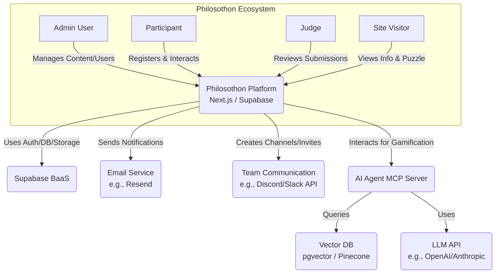
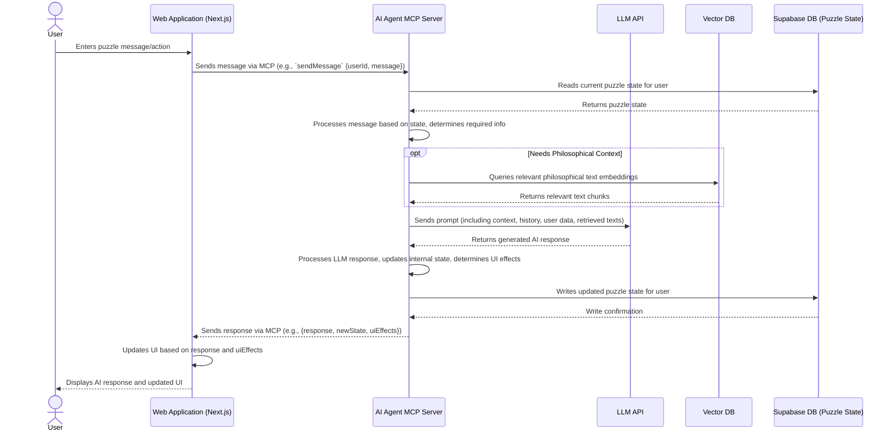
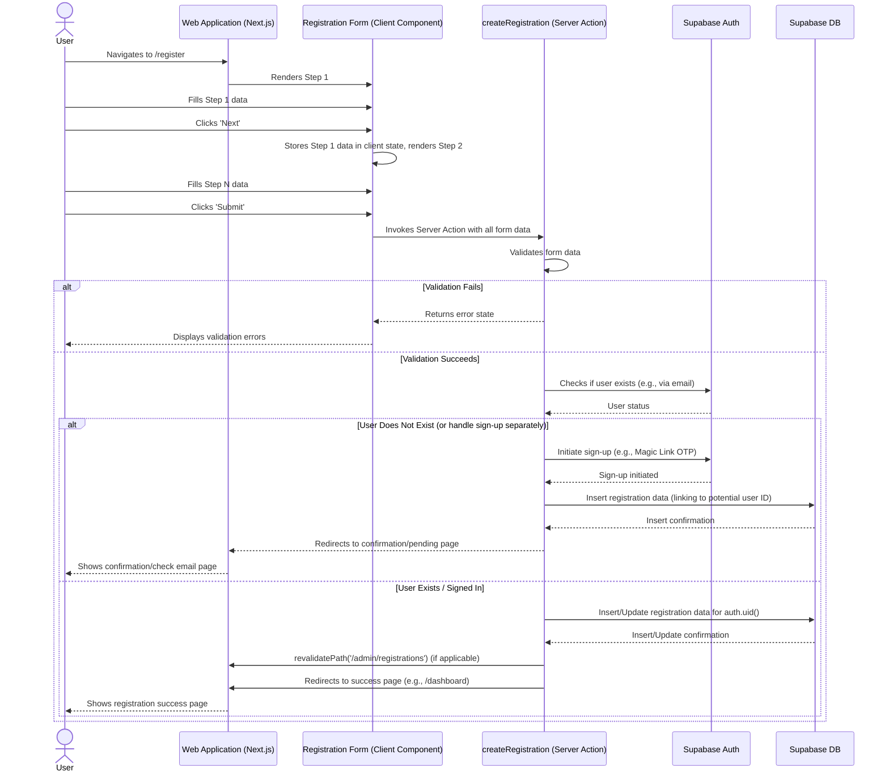

# Architect Specific Memory
<!-- Entries below should be added reverse chronologically (newest first) -->

### Diagram: V2 System Context (C4 Level 1) - [2025-04-19 04:38:30]
- Description: High-level overview showing users interacting with the Philosothon Platform and its key external dependencies.

**Notes:** Shows primary system boundaries and dependencies for V2.

### Diagram: V2 Container Diagram (C4 Level 2) - [2025-04-19 04:38:30]
- Description: Shows the key deployable units/services within the Philosothon Platform V2.
```mermaid
C4Container
    Person(Admin, "Admin User", "Manages content, users, teams")
    Person(Participant, "Participant", "Registers, forms teams, submits work, plays puzzle")
    Person(Judge, "Judge", "Reviews submissions")
    Person(Visitor, "Site Visitor", "Views public info, interacts with puzzle")

    System_Boundary(PlatformBoundary, "Philosothon Platform V2") {
        Container(WebApp, "Web Application", "Next.js 14", "Provides all user interfaces, handles routing, server components, client interactions")
        ContainerDb(Database, "Database", "Supabase PostgreSQL", "Stores user data, content, registration, teams, submissions, puzzle state")
        ContainerAuth(Auth, "Authentication", "Supabase Auth", "Handles user login (Magic Link, potentially others), session management")
        ContainerStorage(Storage, "File Storage", "Supabase Storage", "Stores team submissions")
        ContainerEdgeFunc, "Edge Functions", "Supabase Deno Functions", "Handles backend logic triggered by DB events or HTTP requests (e.g., Discord integration, email notifications)")
        Container(AI_MCP, "AI Agent MCP Server", "Node.js / Python", "Manages gamification AI logic, conversation state, interacts with LLM and Vector DB")
    }

    System_Ext(Supabase, "Supabase BaaS", "Provides DB, Auth, Storage, Edge Functions")
    System_Ext(EmailService, "Email Service", "e.g., Resend, SendGrid", "Sends notifications (registration, submission receipts, puzzle emails)")
    System_Ext(CommPlatform, "Communication Platform API", "e.g., Discord, Slack", "Used by Edge Functions to manage team channels")
    System_Ext(VectorDB, "Vector Database", "Supabase pgvector / Pinecone", "Stores embeddings of philosophical texts for AI Agent")
    System_Ext(LLM_API, "Large Language Model API", "e.g., OpenAI, Anthropic", "Provides language capabilities for AI Agent")

    Rel(Admin, WebApp, "Uses", "HTTPS")
    Rel(Participant, WebApp, "Uses", "HTTPS")
    Rel(Judge, WebApp, "Uses", "HTTPS")
    Rel(Visitor, WebApp, "Uses", "HTTPS")

    Rel(WebApp, Auth, "Authenticates via", "HTTPS/JS Lib")
    Rel(WebApp, Database, "Reads/Writes", "SQL/PostgREST")
    Rel(WebApp, Storage, "Uploads/Downloads", "HTTPS/JS Lib")
    Rel(WebApp, EdgeFunc, "Invokes", "HTTPS")
    Rel(WebApp, AI_MCP, "Interacts with", "HTTP/WebSocket (MCP)")

    Rel(EdgeFunc, Database, "Reads/Writes", "SQL")
    Rel(EdgeFunc, CommPlatform, "Calls API", "HTTPS")
    Rel(EdgeFunc, EmailService, "Calls API", "HTTPS")

    Rel(AI_MCP, VectorDB, "Queries", "DB Connection/API")
    Rel(AI_MCP, LLM_API, "Calls API", "HTTPS")
    Rel(AI_MCP, Database, "Reads/Writes User State", "SQL/PostgREST")

    Boundary(InternalBoundary, "Supabase Services") {
        Rel(Auth, Database, "Reads/Writes User Data")
        Rel(Storage, Database, "Stores Metadata")
    }
```
**Notes:** Illustrates the main services and their interactions.

## System Diagrams

### Diagram: Modular Terminal Component Structure - [2025-04-21 18:49:00]
- Description: Shows the relationship between the Terminal Shell, Input/Output components, State Management, and dynamically rendered Dialog components.
```mermaid
graph TD
    subgraph "Terminal UI"
        TerminalShell[Terminal Shell Component] -->|Renders| ActiveDialog{Active Dialog}
        TerminalShell -->|Displays| OutputHistory[Output History Display]
        TerminalShell -->|Renders| InputLine[Input Line Component]
        InputLine -- User Input --> TerminalShell
    end

    subgraph "Dialog Components (Examples)"
        ActiveDialog -- Implements --> InterestForm[InterestFormPlaceholder]
        ActiveDialog -- Implements --> AuthDialog[AuthDialog]
        ActiveDialog -- Implements --> RegistrationDialog[RegistrationDialog]
        ActiveDialog -- Implements --> GamificationDialog[GamificationDialog]
        ActiveDialog -- Implements --> MainMenuDialog[MainMenuDialog]
    end

    TerminalShell -- Manages State --> StateManagement[State Management (Reducer/Context/Machine)]
    StateManagement -- Determines --> ActiveDialog
    TerminalShell -- Passes Input --> ActiveDialog
    ActiveDialog -- Sends Output/Actions --> TerminalShell
```
**Notes:** This structure promotes separation of concerns. The `TerminalShell` handles the frame and global state, while `ActiveDialog` (implemented by specific components like `AuthDialog`) handles mode-specific logic. See `docs/architecture/terminal_component_v1.md` for details.

---
*Existing System Diagrams Below*


### Sequence Diagram: Submission Upload Flow - [2025-04-19 05:02:00]
- Description: Illustrates the process of a team member uploading a submission file.
```mermaid
sequenceDiagram
    actor Participant as Team Member
    participant WebApp as Web Application (Next.js)
    participant SubmitForm as Submission Form (Client Component)
    participant SupaStorage as Supabase Storage
    participant SupaDB as Supabase DB (submissions table)
    participant EdgeFunc as Supabase Edge Function (Notifications)
    participant EmailService as Email Service

    Participant->>WebApp: Navigates to /submit
    WebApp->>SubmitForm: Renders submission UI (checks role via middleware/layout)
    Participant->>SubmitForm: Selects file(s) to upload
    Participant->>SubmitForm: Clicks 'Submit'
    SubmitForm->>SupaStorage: Uploads file(s) using Supabase client lib (e.g., to `submissions/{team_id}/{file_name}`)
    Note over SubmitForm, SupaStorage: RLS policies on Storage bucket enforce write access for team member.
    SupaStorage-->>SubmitForm: Returns success/failure status and file path
    alt Upload Successful
        SubmitForm->>WebApp: Invokes Server Action or API Route Handler with metadata (teamId, userId, filePath, fileName)
        WebApp->>SupaDB: Inserts submission metadata into `submissions` table
        Note over WebApp, SupaDB: RLS policies on `submissions` table enforce insert access.
        SupaDB-->>WebApp: Insert confirmation
        WebApp-->>SubmitForm: Returns success status
        SubmitForm-->>Participant: Displays success message

        %% Notification Trigger %%
        SupaDB->>EdgeFunc: Triggers function on `submissions` table insert
        EdgeFunc->>SupaDB: Fetches team member emails for team_id
        SupaDB-->>EdgeFunc: Returns emails
        EdgeFunc->>EmailService: Calls API to send submission receipt email
        EmailService-->>EdgeFunc: Send confirmation
    else Upload Failed
        SubmitForm-->>Participant: Displays error message
    end
```
**Notes:** Shows the interaction between the frontend, Supabase Storage for the file itself, Supabase DB for metadata, and an Edge Function triggered for notifications. RLS is crucial at both the Storage and DB levels.


### Sequence Diagram: Gamification AI Interaction - [2025-04-19 05:01:45]
- Description: Illustrates the core interaction loop between a user, the web app, the AI Agent MCP server, and backend services during the puzzle.

**Notes:** This shows a simplified loop. Actual implementation might involve more complex state management, multiple calls to the LLM or Vector DB, and asynchronous operations (e.g., triggering Edge Functions for delayed notifications based on state changes).


### Sequence Diagram: V2 Registration Flow - [2025-04-19 05:01:30]
- Description: Illustrates the interaction sequence for a new user registering via the built-in multi-step form.

**Notes:** Assumes authentication might happen before or during registration. The exact sign-up flow needs refinement (e.g., require login before registration, or create user during registration). Shows use of client state for multi-step form and Server Action for final submission and DB interaction.

<!-- Append new diagrams using the format below -->

### Component Specification: RBAC Middleware - [2025-04-19 04:38:30]
- **Responsibility**: Protect specified Next.js routes based on user authentication status and role.
- **Dependencies**: Supabase SSR client (`@supabase/ssr`), `profiles` table (for role lookup).
- **Interfaces Exposed**: N/A (Middleware function).
- **Internal Structure (Optional High-Level)**: Reads session cookie, fetches user session from Supabase, fetches user role from `profiles` table using `user.id`, checks if route matches protected patterns and if user role is allowed, redirects to login or unauthorized page if necessary.

### Component Specification: Registration Form - [2025-04-19 04:38:30]
- **Responsibility**: Collect V2 registration data from participants across multiple steps/sections.
- **Dependencies**: Server Action (`createRegistration`), UI components (input fields, selects, textareas).
- **Interfaces Exposed**: Standard form interface.
- **Internal Structure (Optional High-Level)**: Multi-step Client Component using `useState` or similar for step management. Uses `useFormState` to handle submission feedback from the Server Action. Renders different field sections based on current step.

### Component Specification: AI Agent Interaction UI - [2025-04-19 04:38:30]
- **Responsibility**: Provide the user interface for interacting with the gamification AI agent.
- **Dependencies**: AI Agent MCP Server (via WebSocket/HTTP), UI components (chat interface).
- **Interfaces Exposed**: Chat input, message display area.
- **Internal Structure (Optional High-Level)**: Client Component managing connection to MCP server, sending user messages, receiving and displaying AI responses, potentially triggering UI transformations based on AI messages or state updates.

## Component Specifications

### Component Specification: TerminalShell - [2025-04-21 18:49:00]
- **Responsibility**: Renders the main terminal frame, manages core state (`mode`, `outputLines`, `commandHistory`, `authStatus`, `dialogState`), renders `OutputHistory` and `InputLine`, dynamically renders the `ActiveDialog` based on `state.mode`, handles global commands, delegates mode-specific input to `ActiveDialog`, provides interaction callbacks (`addOutputLine`, `changeMode`, `setDialogState`) to `ActiveDialog`.
- **Dependencies**: React, State Management (`useReducer`/Context or XState), `InputLine`, `OutputHistory`, Specific Dialog Components (e.g., `AuthDialog`, `RegistrationDialog`).
- **Interfaces Exposed**: Renders the overall terminal UI. Provides props to child components.
- **Internal Structure (Optional High-Level)**: Contains the main state reducer/machine, effect hooks for managing side effects (e.g., command processing delegation), dynamic rendering logic based on `state.mode`.

### Component Specification: InputLine - [2025-04-21 18:49:00]
- **Responsibility**: Renders the command prompt and text input field. Captures user input and calls `onSubmit` prop when user presses Enter.
- **Dependencies**: React.
- **Interfaces Exposed**: Props: `prompt: string`, `onSubmit: (input: string) => void`, `disabled: boolean`, `commandHistory: string[]` (optional, for up/down arrow).
- **Internal Structure (Optional High-Level)**: Uses `<input type="text">`, handles keydown events (Enter, Up/Down arrows), manages internal input value state.

### Component Specification: OutputHistory - [2025-04-21 18:49:00]
- **Responsibility**: Renders the scrollable history of commands and outputs.
- **Dependencies**: React.
- **Interfaces Exposed**: Props: `lines: OutputLine[]`.
- **Internal Structure (Optional High-Level)**: Maps over the `lines` array, rendering each line with appropriate styling based on `line.type`. Manages scrolling to the bottom.

### Component Specification: ActiveDialog (Conceptual) - [2025-04-21 18:49:00]
- **Responsibility**: Represents the currently active interaction mode (e.g., Auth, Registration). Specific implementations (`AuthDialog`, `RegistrationDialog`) handle the UI, logic, and sub-state for that mode. Receives input/commands from the `TerminalShell` and uses provided callbacks to update state or display output.
- **Dependencies**: React, potentially Server Actions or other backend interaction logic.
- **Interfaces Exposed**: Renders the mode-specific UI within the terminal shell. Interacts via props defined in `DialogProps`.
- **Internal Structure (Optional High-Level)**: Varies by specific dialog. Manages its own sub-state (via `setDialogState` prop), processes input/commands relevant to its mode, renders specific UI elements (forms, prompts, messages).

---
*Existing Component Specifications Below*

<!-- Append new component specs using the format below -->

### Interface Definition: AI Agent MCP Server API - [2025-04-19 04:38:30]
- **Purpose**: Define communication between the Next.js frontend and the AI Agent MCP Server for the gamification puzzle.
#### Method/Endpoint: `sendMessage` (WebSocket or HTTP POST)
- Input: `{ userId: string, message: string, puzzleState: object }` / Output: `{ response: string, newState: object, uiEffects: object[] }` / Behavior: Processes user message, interacts with LLM/VectorDB, updates puzzle state, determines AI response and any UI side effects. / Security: Requires authenticated user context (e.g., JWT passed from frontend).
#### Method/Endpoint: `getPuzzleState` (HTTP GET)
- Input: `{ userId: string }` / Output: `{ puzzleState: object }` / Behavior: Retrieves the current puzzle state for the user. / Security: Requires authenticated user context.

## Interface Definitions

### Interface Definition: DialogProps - [2025-04-21 18:49:00]
- **Purpose**: Defines the standard interface for props passed from the `TerminalShell` to the currently active dialog component.
```typescript
interface DialogProps {
  // Function for the dialog to process mode-specific input/commands
  processInput: (input: string) => Promise<void>;

  // Functions provided by the Shell for the Dialog to use
  addOutputLine: (text: string, type: OutputLine['type']) => void;
  changeMode: (newMode: TerminalMode, options?: { initialDialogState?: any }) => void;
  setDialogState: (newState: any) => void; // Updates state.dialogState[currentMode]

  // State provided by the Shell
  currentDialogState: any; // The specific sub-state for this dialog (state.dialogState[currentMode])
  userSession: { isAuthenticated: boolean; email: string | null } | null; // Auth info
}
```
**Notes:** This interface ensures consistent communication between the shell and various dialog components. Dialogs receive necessary context and functions to interact with the terminal state and UI.

---
*Existing Interface Definitions Below*

<!-- Append new interface definitions using the format below -->

### Data Model: `profiles` - [2025-04-19 04:38:30]
- **Purpose**: Store user profile information, including role for RBAC.
- **Structure**: 
```sql
-- Enable RLS
ALTER TABLE profiles ENABLE ROW LEVEL SECURITY;

-- Define ENUM type for roles
CREATE TYPE user_role AS ENUM ('admin', 'participant', 'judge', 'team_member');

CREATE TABLE profiles (
  id UUID PRIMARY KEY REFERENCES auth.users(id) ON DELETE CASCADE,
  full_name TEXT, -- Consider NOT NULL depending on requirements
  avatar_url TEXT, -- URL to user's avatar image
  role user_role DEFAULT 'participant' NOT NULL,
  team_id UUID REFERENCES teams(id) ON DELETE SET NULL, -- Link to the team the user belongs to
  -- other profile fields as needed...
  created_at TIMESTAMPTZ DEFAULT now() NOT NULL,
  updated_at TIMESTAMPTZ DEFAULT now() NOT NULL
);

-- Policies for RLS (Examples - refine based on specific needs)
-- Users can view their own profile
CREATE POLICY "Allow individual user access" ON profiles FOR SELECT USING (auth.uid() = id);
-- Admins can view all profiles
CREATE POLICY "Allow admin access" ON profiles FOR SELECT USING (EXISTS (SELECT 1 FROM profiles WHERE id = auth.uid() AND role = 'admin'));
-- Allow users to update their own profile (specific columns)
CREATE POLICY "Allow individual user update" ON profiles FOR UPDATE USING (auth.uid() = id) WITH CHECK (auth.uid() = id);
-- Allow admins to update any profile
CREATE POLICY "Allow admin update" ON profiles FOR UPDATE USING (EXISTS (SELECT 1 FROM profiles WHERE id = auth.uid() AND role = 'admin'));

-- Trigger to update updated_at timestamp
CREATE TRIGGER handle_updated_at BEFORE UPDATE ON profiles
  FOR EACH ROW EXECUTE PROCEDURE moddatetime (updated_at);
```
- **Relationships**: One-to-one with `auth.users`. Foreign key to `teams`.
- **Notes**: RLS policies need careful definition based on exact access requirements. Consider indexing `role` and `team_id`.

### Data Model: `registrations` (Extended) - [2025-04-19 04:38:30]
- **Purpose**: Store participant registration data, including V2 enhanced fields.
- **Structure**: 
```sql
-- Enable RLS (assuming registrations table exists and needs protection)
ALTER TABLE registrations ENABLE ROW LEVEL SECURITY;

-- Define ENUM types used in registration
CREATE TYPE attendance_option AS ENUM ('yes', 'no', 'maybe');
CREATE TYPE working_style AS ENUM ('structured', 'exploratory', 'balanced');

-- Add columns to existing registrations table (assuming it has user_id link)
ALTER TABLE registrations
  ADD COLUMN user_id UUID REFERENCES auth.users(id) ON DELETE CASCADE, -- Ensure link exists
  ADD COLUMN can_attend_may_3_4 attendance_option,
  ADD COLUMN may_3_4_comment TEXT,
  ADD COLUMN prior_courses TEXT[], -- Array of course names/codes
  ADD COLUMN familiarity_analytic INTEGER CHECK (familiarity_analytic BETWEEN 1 AND 5),
  ADD COLUMN familiarity_continental INTEGER CHECK (familiarity_continental BETWEEN 1 AND 5),
  ADD COLUMN familiarity_other INTEGER CHECK (familiarity_other BETWEEN 1 AND 5),
  ADD COLUMN areas_of_interest TEXT,
  ADD COLUMN preferred_working_style working_style,
  ADD COLUMN skill_writing INTEGER CHECK (skill_writing BETWEEN 1 AND 5),
  ADD COLUMN skill_speaking INTEGER CHECK (skill_speaking BETWEEN 1 AND 5),
  ADD COLUMN skill_research INTEGER CHECK (skill_research BETWEEN 1 AND 5),
  ADD COLUMN skill_synthesis INTEGER CHECK (skill_synthesis BETWEEN 1 AND 5),
  ADD COLUMN skill_critique INTEGER CHECK (skill_critique BETWEEN 1 AND 5),
  ADD COLUMN preferred_teammates TEXT, -- Store as text, parsing/matching handled by algorithm
  ADD COLUMN complementary_perspectives TEXT,
  ADD COLUMN familiarity_tech_concepts INTEGER CHECK (familiarity_tech_concepts BETWEEN 1 AND 5),
  ADD COLUMN prior_hackathon_experience BOOLEAN,
  ADD COLUMN prior_hackathon_details TEXT,
  ADD COLUMN accessibility_needs TEXT,
  ADD COLUMN created_at TIMESTAMPTZ DEFAULT now() NOT NULL,
  ADD COLUMN updated_at TIMESTAMPTZ DEFAULT now() NOT NULL;

-- Alternative: Create registration_details table
-- CREATE TABLE registration_details (
--   registration_id UUID PRIMARY KEY REFERENCES registrations(id) ON DELETE CASCADE,
--   -- Add columns here...
-- );

-- Policies for RLS (Examples)
-- Users can view/update their own registration
CREATE POLICY "Allow individual access" ON registrations FOR ALL USING (auth.uid() = user_id) WITH CHECK (auth.uid() = user_id);
-- Admins can access all registrations
CREATE POLICY "Allow admin access" ON registrations FOR ALL USING (EXISTS (SELECT 1 FROM profiles WHERE id = auth.uid() AND role = 'admin'));

-- Trigger to update updated_at timestamp
CREATE TRIGGER handle_updated_at BEFORE UPDATE ON registrations
  FOR EACH ROW EXECUTE PROCEDURE moddatetime (updated_at);

```
- **Relationships**: Linked one-to-one with `auth.users` (or `profiles`).
- **Notes**: Using `ALTER TABLE` assumes a `registrations` table exists; adjust if creating new. `CHECK` constraints enforce scale validity. RLS policies restrict access. Consider indexing fields used for team formation.

### Data Model: `teams` - [2025-04-19 04:38:30]
- **Purpose**: Store information about formed teams.
- **Structure**: 
```sql
-- Enable RLS
ALTER TABLE teams ENABLE ROW LEVEL SECURITY;

CREATE TABLE teams (
  id UUID PRIMARY KEY DEFAULT gen_random_uuid(),
  team_name TEXT NOT NULL UNIQUE, -- Ensure team names are unique
  created_at TIMESTAMPTZ DEFAULT now() NOT NULL,
  -- other team metadata like project focus, description etc.
  updated_at TIMESTAMPTZ DEFAULT now() NOT NULL
);

-- Policies for RLS (Examples)
-- Allow authenticated users to view all teams (or just team members/admins?)
CREATE POLICY "Allow read access" ON teams FOR SELECT USING (auth.role() = 'authenticated');
-- Allow admins to create/update/delete teams
CREATE POLICY "Allow admin modification" ON teams FOR ALL USING (EXISTS (SELECT 1 FROM profiles WHERE id = auth.uid() AND role = 'admin'));

-- Trigger to update updated_at timestamp
CREATE TRIGGER handle_updated_at BEFORE UPDATE ON teams
  FOR EACH ROW EXECUTE PROCEDURE moddatetime (updated_at);
```
- **Relationships**: Linked from `profiles` table (`profiles.team_id` references `teams.id`).
- **Notes**: RLS policies determine who can see team details. Consider indexing `team_name`.

### Data Model: `submissions` - [2025-04-19 04:38:30]
- **Purpose**: Store metadata about team submissions.
- **Structure**: 
```sql
-- Enable RLS
ALTER TABLE submissions ENABLE ROW LEVEL SECURITY;

CREATE TABLE submissions (
  id UUID PRIMARY KEY DEFAULT gen_random_uuid(),
  team_id UUID NOT NULL REFERENCES teams(id) ON DELETE CASCADE,
  submitter_user_id UUID NOT NULL REFERENCES auth.users(id),
  file_path TEXT NOT NULL UNIQUE, -- Path in Supabase Storage, should be unique
  file_name TEXT NOT NULL,
  submitted_at TIMESTAMPTZ DEFAULT now() NOT NULL,
  version INTEGER DEFAULT 1 NOT NULL CHECK (version > 0)
  -- Potentially add file size, content type if needed
);

-- Add indexes for common lookups
CREATE INDEX idx_submissions_team_id ON submissions(team_id);
CREATE INDEX idx_submissions_submitter_user_id ON submissions(submitter_user_id);

-- Policies for RLS (Examples)
-- Allow team members to view/insert their team's submissions
CREATE POLICY "Allow team member access" ON submissions FOR ALL
  USING (EXISTS (SELECT 1 FROM profiles WHERE id = auth.uid() AND team_id = submissions.team_id))
  WITH CHECK (EXISTS (SELECT 1 FROM profiles WHERE id = auth.uid() AND team_id = submissions.team_id));
-- Allow judges to view all submissions
CREATE POLICY "Allow judge read access" ON submissions FOR SELECT
  USING (EXISTS (SELECT 1 FROM profiles WHERE id = auth.uid() AND role = 'judge'));
-- Allow admins to access all submissions
CREATE POLICY "Allow admin access" ON submissions FOR ALL
  USING (EXISTS (SELECT 1 FROM profiles WHERE id = auth.uid() AND role = 'admin'));

```
- **Relationships**: Many-to-one with `teams`, `auth.users`.
- **Notes**: RLS policies are crucial here. `file_path` uniqueness prevents accidental overwrites if paths aren't generated carefully. Indexes improve query performance.

### Data Model: `user_puzzle_progress` - [2025-04-19 04:38:30]
- **Purpose**: Track individual user progress through the gamification puzzle.
- **Structure**: 
```sql
-- Enable RLS
ALTER TABLE user_puzzle_progress ENABLE ROW LEVEL SECURITY;

CREATE TABLE user_puzzle_progress (
  user_id UUID PRIMARY KEY REFERENCES auth.users(id) ON DELETE CASCADE,
  current_stage INTEGER DEFAULT 0 NOT NULL CHECK (current_stage >= 0),
  completed_steps TEXT[] DEFAULT ARRAY[]::TEXT[], -- Array of identifiers for completed steps/clues
  puzzle_state JSONB DEFAULT '{}'::jsonb, -- Flexible store for current variables, flags, interaction history
  created_at TIMESTAMPTZ DEFAULT now() NOT NULL,
  last_updated_at TIMESTAMPTZ DEFAULT now() NOT NULL
);

-- Policies for RLS (Examples)
-- Allow user to access/update their own progress
CREATE POLICY "Allow individual access" ON user_puzzle_progress FOR ALL
  USING (auth.uid() = user_id) WITH CHECK (auth.uid() = user_id);
-- Allow admins (or maybe a specific service role for the MCP server) to access/update progress
CREATE POLICY "Allow admin/service access" ON user_puzzle_progress FOR ALL
  USING (EXISTS (SELECT 1 FROM profiles WHERE id = auth.uid() AND role = 'admin')); -- Or check for service role

-- Trigger to update last_updated_at timestamp
CREATE TRIGGER handle_updated_at BEFORE UPDATE ON user_puzzle_progress
  FOR EACH ROW EXECUTE PROCEDURE moddatetime (last_updated_at);
```
- **Relationships**: One-to-one with `auth.users`.
- **Notes**: RLS ensures users only modify their own progress. `puzzle_state` JSONB offers flexibility. Consider if the MCP server needs a dedicated service role for updates instead of using admin privileges.

## Data Models
<!-- Append new data models using the format below -->